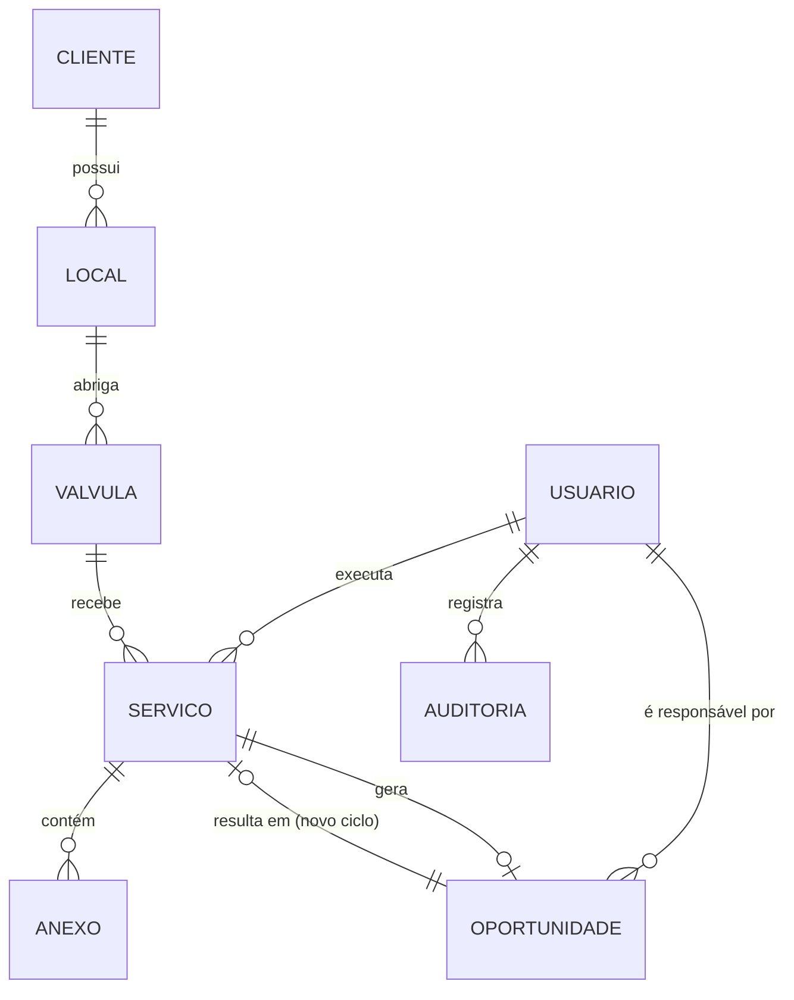
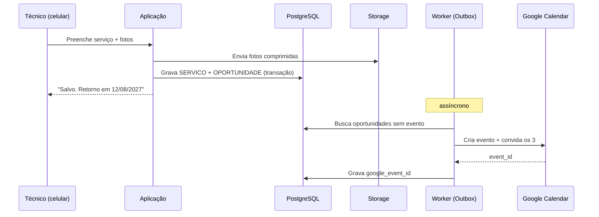

# Valtis — Documentação do Projeto (v0.2)

**Cliente:** Manutec Válvulas — manutenção hidráulica predial
**Autor da ideia:** Daniel Tabosa
**Data:** 13/08/2026
**Status:** Rascunho de requisitos e arquitetura. Nenhuma linha de código escrita.

### Decisões fechadas nesta versão

| # | Tema | Decisão |
|---|---|---|
| D-01 | Conta Google | **Gmail comum.** Agenda compartilhada da empresa, autenticação OAuth com refresh token. Conta de serviço descartada |
| D-02 | Preenchimento em campo | **Não precisa ser no local.** Técnico lança em momento propício com internet estável. **Offline sai do escopo** |
| D-03 | Antecedência do alerta | Evento criado **7 dias antes** do vencimento do ciclo |
| D-04 | Follow-up | **Fila sem dono fixo.** Qualquer um dos 3 assume a oportunidade e marca no sistema |
| D-05 | Recusa do cliente | Sistema **pergunta na hora** se e quando voltar a lembrar |
| D-06 | Base histórica | **Existe em planilha.** Importação entra no escopo prioritário |

> **Legenda de origem**
> `[INFORMADO]` — veio da descrição do Daniel.
> `[DECIDIDO]` — respondido nas perguntas de escopo.
> `[SUGESTÃO]` — proposta minha, ainda **não** validada. Pode ser cortada sem prejuízo.
> `[A DEFINIR]` — decisão pendente, listada no capítulo 6.

---

## 1. Visão geral e problema de negócio

### 1.1 A dor `[INFORMADO]`
A Manutec instala e faz manutenção de VRPs (válvulas redutoras de pressão) em prédios. Toda VRP mantida tem uma janela natural de reventa de manutenção cerca de **12 meses depois**. Hoje:

- O rastreamento dessas oportunidades é feito **manualmente**, garimpando registros antigos.
- É feito **em momentos vagos**, sem processo nem responsável fixo.
- Consequência: oportunidades vencem sem contato. É **dinheiro na mesa não aproveitado**.

### 1.2 A proposta `[INFORMADO]`
Uma aplicação web onde o time de campo registra o serviço executado. O sistema:

1. Persiste o registro em banco de dados.
2. Cria automaticamente um **evento no Google Calendar 1 ano após** o registro, sinalizando a oportunidade de reventa.

### 1.3 Objetivo mensurável `[SUGESTÃO]`
Sem uma métrica, não há como saber se o sistema funcionou. Proponho:

| Indicador | Situação hoje | Meta |
|---|---|---|
| % de VRPs com retorno contatado dentro da janela | não medido | ≥ 90% |
| % de oportunidades convertidas em venda | não medido | medir na Fase 1, definir meta na Fase 3 |
| Tempo para registrar um atendimento em campo | não medido | ≤ 3 minutos |

### 1.4 O que este sistema **não** é `[SUGESTÃO — validar]`
Delimitar o escopo agora evita que o projeto vire um ERP e nunca saia do papel. Fora de escopo na v1:

- Emissão de nota fiscal, financeiro, contas a receber.
- Controle de estoque de peças.
- Roteirização/otimização de rotas de campo.
- Portal de acesso para o cliente final.
- App nativo em loja (iOS/Android). Será web responsiva.

---

## 2. Usuários e perfis

### 2.1 Quem usa `[INFORMADO]`
**3 pessoas** com permissão de preencher dados. Uso em **celular no campo** e **PC no escritório**.

### 2.2 Perfis propostos `[SUGESTÃO]`
Com 3 usuários, papéis complexos são desperdício. Proponho apenas dois:

| Perfil | Pode | Não pode |
|---|---|---|
| **Técnico** | Criar e editar registros de serviço próprios, anexar fotos, consultar histórico | Excluir registros, alterar configurações, editar registro de outro usuário depois de 24h |
| **Administrador** | Tudo do técnico + cadastrar clientes/locais, editar/excluir qualquer registro, gerenciar usuários, ver painel gerencial | — |

`[A DEFINIR]` As 3 pessoas são todas técnicos de campo, ou tem alguém só no escritório? Alguém deve ser exclusivamente administrador?

---

## 3. Requisitos Funcionais (RF)

Prioridade: **P0** = MVP obrigatório · **P1** = próxima entrega · **P2** = desejável.

### 3.1 Autenticação e acesso

| ID | Requisito | Prio | Origem |
|---|---|---|---|
| RF-01 | Usuário faz login com credencial individual antes de acessar qualquer dado | P0 | `[SUGESTÃO]` — implícito em "3 pessoas vão ter poder de preencher" |
| RF-02 | Sistema mantém sessão ativa por período longo no celular, evitando relogin a cada visita | P0 | `[SUGESTÃO]` |
| RF-03 | Administrador cadastra, desativa e redefine senha dos usuários | P1 | `[SUGESTÃO]` |
| RF-04 | Todo registro guarda quem criou e quando | P0 | `[SUGESTÃO]` |

### 3.2 Cadastro de clientes, locais e válvulas

| ID | Requisito | Prio | Origem |
|---|---|---|---|
| RF-05 | Cadastrar cliente (condomínio/empresa) com dados de contato | P0 | `[SUGESTÃO]` — necessário para o registro ter sentido |
| RF-06 | Cadastrar local/prédio vinculado a um cliente, com endereço e observações de acesso | P0 | `[SUGESTÃO]` |
| RF-07 | Cadastrar VRP vinculada a um local, com identificação, marca, modelo, diâmetro e localização física ("casa de máquinas — subsolo 2") | P0 | `[SUGESTÃO]` |
| RF-08 | Permitir criar cliente/local/válvula **de dentro do formulário de campo**, sem sair da tela | P0 | `[SUGESTÃO]` — crítico para usabilidade em campo |
| RF-09 | Marcar válvula como removida/substituída, preservando o histórico no local | P1 | `[SUGESTÃO]` |
| RF-10 | Buscar cliente/local/válvula por nome, endereço ou código | P0 | `[SUGESTÃO]` |

### 3.3 Registro de serviço (coração do sistema)

| ID | Requisito | Prio | Origem |
|---|---|---|---|
| RF-11 | Registrar atendimento executado em uma VRP, com data de execução, tipo de serviço e descrição | P0 | `[INFORMADO]` |
| RF-12 | Registrar pressão de entrada e de saída medidas | P0 | `[SUGESTÃO]` — dado técnico central em VRP; **confirmar** |
| RF-13 | Registrar peças substituídas | P1 | `[SUGESTÃO]` |
| RF-14 | Anexar fotos da válvula/instalação, **tanto pela câmera quanto pela galeria do celular** | P0 | `[DECIDIDO]` · galeria é essencial por D-02: a foto é tirada no local, o lançamento acontece depois |
| RF-15 | Comprimir a foto no dispositivo antes do upload | P0 | `[SUGESTÃO]` |
| RF-16 | Salvar registro como rascunho e concluir depois | P1 | `[SUGESTÃO]` |
| RF-16b | A **data de execução é sempre informada pelo técnico**, nunca assumida como a data de preenchimento | P0 | `[SUGESTÃO]` — consequência direta de D-02; toda a recorrência depende disso |
| RF-16c | Alertar quando houver atendimentos executados e ainda não lançados há mais de X dias | P2 | `[SUGESTÃO]` — o risco de D-02 é o lançamento nunca acontecer |
| RF-17 | Editar registro recém-criado (correção de erro de digitação) | P0 | `[SUGESTÃO]` |
| RF-18 | Ver histórico completo de atendimentos de uma VRP em ordem cronológica | P1 | `[SUGESTÃO]` |

### 3.4 Recorrência e Google Calendar

| ID | Requisito | Prio | Origem |
|---|---|---|---|
| RF-19 | Ao salvar um registro, o sistema calcula automaticamente a data de retorno = data de execução + 12 meses | P0 | `[INFORMADO]` |
| RF-20 | O sistema cria um evento na **agenda da empresa** ("Manutenções VRP"), pertencente a uma conta Gmail da Manutec, com os 3 usuários como convidados | P0 | `[DECIDIDO]` · D-01 |
| RF-21 | O evento traz no título e na descrição: cliente, local, identificação da válvula, data do último serviço e link direto para o registro no sistema | P0 | `[SUGESTÃO]` |
| RF-22 | A periodicidade padrão de 12 meses é configurável por válvula, para contratos semestrais ou trimestrais | P1 | `[SUGESTÃO]` — **confirmar se existe esse caso** |
| RF-23 | Se a criação do evento falhar (API fora, token expirado), o registro **é salvo de qualquer forma** e o agendamento entra numa fila de reprocessamento | P0 | `[SUGESTÃO]` — ver 4.4 |
| RF-24 | Editar a data de execução ou cancelar o registro atualiza/remove o evento correspondente | P1 | `[SUGESTÃO]` |
| RF-25 | Painel mostra quais registros ainda não conseguiram sincronizar com o Calendar | P1 | `[SUGESTÃO]` |
| RF-26 | O evento é criado **7 dias antes** da data de vencimento do ciclo (`data_execucao + 12 meses − 7 dias`) | P0 | `[DECIDIDO]` · D-03 |
| RF-26b | A antecedência é **configurável em um só lugar**, aplicando-se aos agendamentos futuros | P1 | `[SUGESTÃO]` — barato de fazer agora e evita retrabalho se 7 dias se mostrar curto |

### 3.5 Painel e pipeline de oportunidades

| ID | Requisito | Prio | Origem |
|---|---|---|---|
| RF-27 | Listar todos os registros de serviço com filtros por cliente, local, técnico, período e status | P0 | `[DECIDIDO]` |
| RF-28 | Visão "Retornos" ordenada por data de vencimento, destacando vencidos, vencendo em 30 dias e futuros | P0 | `[SUGESTÃO]` — é aqui que a dor é resolvida de fato |
| RF-29 | Marcar o desfecho de uma oportunidade: contatado / aceito / recusado / executado / perdido | P1 | `[SUGESTÃO]` |
| RF-30 | Oportunidade nasce **sem dono**, numa fila. Qualquer usuário pode "assumir" com um toque, e o sistema passa a mostrar quem assumiu | P1 | `[DECIDIDO]` · D-04 |
| RF-30b | Destacar visualmente oportunidades **vencendo sem ninguém ter assumido** | P1 | `[SUGESTÃO]` — sem isso, fila sem dono vira "de todos, logo de ninguém". Ver risco 6.13 |
| RF-30c | Registrar quem assumiu, quando, e o histórico de contatos da oportunidade | P2 | `[SUGESTÃO]` |
| RF-31 | Ao registrar a manutenção da reventa, a oportunidade é fechada e um novo ciclo de 12 meses é iniciado | P1 | `[SUGESTÃO]` |
| RF-32 | Exportar a listagem filtrada para CSV/Excel | P2 | `[SUGESTÃO]` |
| RF-33 | Dashboard com nº de oportunidades no período, taxa de conversão e receita recuperada | P2 | `[SUGESTÃO]` |

### 3.6 Relatório em PDF

| ID | Requisito | Prio | Origem |
|---|---|---|---|
| RF-34 | Gerar PDF do relatório de serviço com logo da Manutec, dados do cliente/local/válvula, medições, descrição, fotos e data do próximo retorno | P1 | `[DECIDIDO]` |
| RF-35 | Baixar ou compartilhar o PDF direto do celular (WhatsApp/e-mail via compartilhamento nativo) | P1 | `[SUGESTÃO]` |
| RF-36 | Enviar o PDF por e-mail ao cliente de dentro do sistema | P2 | `[SUGESTÃO]` |

### 3.7 Importação do legado

| ID | Requisito | Prio | Origem |
|---|---|---|---|
| RF-37 | Importar a base histórica via planilha, para que oportunidades antigas já entrem no pipeline | **P0** | `[DECIDIDO]` · D-06 |
| RF-38 | O importador deve pré-visualizar, apontar linhas com erro e permitir corrigir antes de gravar | P0 | `[SUGESTÃO]` — planilha manual sempre tem inconsistência de nome de cliente |
| RF-39 | Importação não pode duplicar cliente/local/válvula já existentes | P0 | `[SUGESTÃO]` |
| RF-40 | Registros importados com vencimento **já passado** entram no painel como "vencidos", não geram evento retroativo no Calendar | P0 | `[SUGESTÃO]` — criar dezenas de eventos no passado só polui a agenda |

---

## 4. Requisitos Não Funcionais (RNF)

### 4.1 Usabilidade — o requisito mais crítico deste projeto
Se o preenchimento em campo for chato, o sistema morre e a empresa volta para a planilha.

| ID | Requisito | Origem |
|---|---|---|
| RNF-01 | Interface responsiva, mesma aplicação funcionando em celular e PC | `[INFORMADO]` |
| RNF-02 | Formulário de campo preenchível com uma mão, em pé, com alvos de toque ≥ 44px | `[SUGESTÃO]` |
| RNF-03 | Registro completo de um atendimento em ≤ 3 minutos e ≤ 10 campos obrigatórios | `[SUGESTÃO]` |
| RNF-04 | Instalável na tela inicial do celular como PWA, abrindo sem barra de navegador | `[SUGESTÃO]` |
| RNF-05 | Campos técnicos com teclado numérico automático; datas com seletor nativo | `[SUGESTÃO]` |
| RNF-06 | Interface e documentação em português do Brasil | `[SUGESTÃO]` |

### 4.2 Conectividade
**D-02 simplificou muito este bloco.** Como o lançamento acontece em momento propício e com internet estável, o sistema **pode assumir conexão disponível**. Funcionamento offline, sincronização e fila local saem do escopo — economia relevante de complexidade.

| ID | Requisito | Origem |
|---|---|---|
| RNF-07 | Perda momentânea de conexão durante o preenchimento não pode apagar o que já foi digitado (preservar estado do formulário no navegador) | `[SUGESTÃO]` — proteção barata contra aba fechada ou bateria acabando |
| RNF-08 | ~~Rascunho offline sincronizado~~ — **removido do escopo por D-02** | `[DECIDIDO]` |
| RNF-09 | Upload de fotos com feedback de progresso e nova tentativa em caso de falha | `[SUGESTÃO]` |

### 4.3 Desempenho e escala

| ID | Requisito | Origem |
|---|---|---|
| RNF-10 | Carregamento inicial em 3G ≤ 5s; navegação entre telas ≤ 1s | `[SUGESTÃO]` |
| RNF-11 | Suportar 3 usuários simultâneos hoje e até 20 sem mudança de arquitetura | `[SUGESTÃO]` |
| RNF-12 | Suportar 10 anos de histórico (estimativa: milhares de registros, não milhões) sem degradação | `[SUGESTÃO]` — depende do volume em 6.7 |

### 4.4 Confiabilidade e integridade

| ID | Requisito | Origem |
|---|---|---|
| RNF-13 | Falha na API do Google **nunca** pode causar perda de um registro de serviço | `[SUGESTÃO]` |
| RNF-14 | Backup automático diário do banco, com retenção mínima de 30 dias e restauração testada | `[SUGESTÃO]` |
| RNF-15 | Fotos armazenadas com redundância e não apagáveis por exclusão acidental de registro (exclusão lógica) | `[SUGESTÃO]` |
| RNF-16 | Trilha de auditoria de criação, alteração e exclusão de registros | `[SUGESTÃO]` |
| RNF-17 | Disponibilidade alvo 99% em horário comercial. Não é sistema crítico de tempo real | `[SUGESTÃO]` |

### 4.5 Segurança e conformidade

| ID | Requisito | Origem |
|---|---|---|
| RNF-18 | Todo tráfego em HTTPS | `[SUGESTÃO]` |
| RNF-19 | Senhas com hash forte; nenhum segredo em código-fonte | `[SUGESTÃO]` |
| RNF-20 | Credenciais do Google Calendar armazenadas cifradas, fora do repositório | `[SUGESTÃO]` |
| RNF-21 | Adequação à LGPD: o sistema guarda nome, telefone e e-mail de síndicos e zeladores (dado pessoal). Requer base legal, finalidade declarada e política de retenção | `[SUGESTÃO]` — ver 6.10 |
| RNF-22 | Acesso restrito por autenticação; nenhuma tela pública com dado de cliente | `[SUGESTÃO]` |

### 4.6 Manutenibilidade e custo

| ID | Requisito | Origem |
|---|---|---|
| RNF-23 | Uma única linguagem no front e no back, para viabilizar manutenção por uma pessoa | `[SUGESTÃO]` |
| RNF-24 | Deploy automatizado a partir do repositório Git, sem passo manual | `[SUGESTÃO]` |
| RNF-25 | Custo mensal de infraestrutura alvo ≤ R$ 150/mês na fase inicial | `[SUGESTÃO]` — ver 6.11 |
| RNF-26 | Dados exportáveis integralmente (sem lock-in do fornecedor de nuvem) | `[SUGESTÃO]` |

---

## 5. Entidades e relacionamentos

### 5.1 Modelo recomendado

Você pediu minha recomendação. Recomendo o modelo **Cliente → Local → Válvula → Serviço**, com uma quinta entidade que considero a mais importante do sistema: **Oportunidade**.

**Por quê não "um registro por serviço":** a dor não é "registrar serviço", é *"saber quais válvulas estão vencendo"*. Se cliente e endereço forem texto livre em cada linha, "Cond. Ed. Solar" e "Condomínio Edifício Solar" viram dois clientes diferentes e o histórico por válvula se perde — exatamente o problema de hoje, só que digital. O custo extra é uma tela de cadastro; o ganho é o histórico confiável.

**Por quê "Oportunidade" separada de "Serviço":** um evento no Calendar não é rastreável. Sem esta entidade você sabe que *lembrou*, mas não sabe se *contatou*, se o cliente *recusou*, nem qual foi a taxa de conversão. É ela que transforma "dinheiro na mesa" em número.

### 5.2 Diagrama



### 5.3 Entidades

**USUARIO** — as 3 pessoas com acesso.
`id` · `nome` · `email` · `senha_hash` · `perfil` (tecnico | admin) · `ativo` · `criado_em`

**CLIENTE** — condomínio, empresa ou administradora contratante.
`id` · `nome` · `cnpj_cpf` `[A DEFINIR]` · `administradora` · `contato_nome` · `contato_telefone` · `contato_email` · `observacoes` · `criado_em`

**LOCAL** — o prédio/endereço atendido. Um cliente pode ter vários.
`id` · `cliente_id` → CLIENTE · `apelido` · `endereco` · `cidade` · `uf` · `cep` · `contato_local` (zelador) · `observacoes_acesso` (chave, horário, autorização) · `ativo`

**VALVULA** — o ativo. É a entidade que tem ciclo de manutenção.
`id` · `local_id` → LOCAL · `codigo_interno` · `tipo` (VRP | outro) · `marca` · `modelo` · `diametro` · `localizacao_fisica` · `pressao_entrada_nominal` · `pressao_saida_alvo` · `data_instalacao` · `periodicidade_meses` (padrão **12**) · `status` (ativa | removida | substituida) · `substituida_por_id` → VALVULA

**SERVICO** — o atendimento executado. É o que o time de campo preenche.
`id` · `valvula_id` → VALVULA · `tipo` (instalacao | preventiva | corretiva | vistoria) · `data_execucao` · `tecnico_id` → USUARIO · `pressao_entrada_medida` · `pressao_saida_medida` · `descricao` · `pecas_substituidas` · `valor_cobrado` `[A DEFINIR]` · `observacoes` · `data_proximo_retorno` (calculada) · `status` (rascunho | concluido) · `criado_por` → USUARIO · `criado_em` · `atualizado_em`

**ANEXO** — fotos e documentos do atendimento.
`id` · `servico_id` → SERVICO · `caminho_arquivo` · `tipo_mime` · `tamanho_bytes` · `legenda` · `criado_em`

**OPORTUNIDADE** — o retorno agendado e seu desfecho comercial.
`id` · `valvula_id` → VALVULA · `servico_origem_id` → SERVICO · `data_prevista` · `data_alerta` (= `data_prevista − 7 dias`) · `status` (agendado | contatado | aceito | recusado | executado | perdido) · `responsavel_id` → USUARIO **(nulo até alguém assumir — D-04)** · `assumida_em` · `origem` (sistema | importacao) · `google_event_id` · `sincronizado_em` · `tentativas_sync` · `notas` · `servico_resultante_id` → SERVICO

**AUDITORIA** — trilha de alterações.
`id` · `usuario_id` → USUARIO · `entidade` · `entidade_id` · `acao` (criou | alterou | excluiu) · `dados_antes` · `dados_depois` · `criado_em`

### 5.4 Regras de negócio derivadas

| ID | Regra | Origem |
|---|---|---|
| RN-01 | `OPORTUNIDADE.data_prevista = SERVICO.data_execucao + VALVULA.periodicidade_meses` (padrão 12). A **data de execução informada pelo técnico** é a base do cálculo — nunca a data de preenchimento | `[INFORMADO]` + D-02 |
| RN-01b | O evento no Calendar é criado em `data_prevista − 7 dias` | `[DECIDIDO]` · D-03 |
| RN-02 | Todo SERVICO concluído gera exatamente uma OPORTUNIDADE com `status = agendado` e **sem responsável** | `[SUGESTÃO]` + D-04 |
| RN-03 | Ao criar um SERVICO novo para uma válvula, oportunidades abertas dela passam a `executado` e são vinculadas via `servico_resultante_id` | `[SUGESTÃO]` |
| RN-04 | Ao marcar `recusado`, o sistema **pergunta ao usuário** se deve voltar a lembrar e em qual data. Se sim, cria nova OPORTUNIDADE nessa data; se não, encerra o ciclo daquela válvula até reativação manual | `[DECIDIDO]` · D-05 |
| RN-07 | Qualquer usuário pode assumir uma oportunidade sem dono. Uma vez assumida, continua editável pelos demais, mas o nome de quem assumiu fica visível | `[DECIDIDO]` · D-04 |
| RN-05 | Válvula com `status = removida` não gera novas oportunidades | `[SUGESTÃO]` |
| RN-06 | Um SERVICO exige pelo menos uma foto `[A DEFINIR]` — obrigatório ou opcional? | `[SUGESTÃO]` |

---

## 6. Riscos, ambiguidades e decisões pendentes

Ordenados por impacto. ✅ = decidido na v0.2.

### 6.1 ✅ Tipo de conta Google — **RESOLVIDO (D-01): Gmail comum**
Consequência: conta de serviço está fora, porque não envia convite para contas Gmail externas. O caminho é:

1. Criar (ou usar) uma conta Gmail da empresa como **dona** da agenda "Manutenções VRP".
2. Compartilhar essa agenda com os 3 usuários, com permissão de alteração.
3. O sistema autentica **como essa conta** via OAuth, guardando um *refresh token*.

**Pontos operacionais que precisam de atenção — não são opcionais:**

- O refresh token de um app OAuth em modo *Testing* **expira em poucos dias**. É obrigatório publicar o app como "Em produção" no Google Cloud Console, ainda que sem verificação (o limite de usuários de apps não verificados é irrelevante aqui, são 3).
- Como o app não será verificado pelo Google, quem autorizar verá uma tela de aviso. É contornável, mas precisa ser feito uma vez, conscientemente.
- O token deve ficar cifrado fora do repositório (RNF-20) e o sistema precisa avisar caso ele seja revogado — senão os agendamentos param de silenciosamente e ninguém percebe.
- Escopo mínimo: apenas gerenciamento de eventos da agenda, nada além disso.

**Risco residual:** essa conta Gmail vira um ponto único de falha. Se a senha se perder ou a conta for desativada, os agendamentos param. Mitigação: conta institucional (não pessoal de um funcionário), com recuperação configurada e credenciais em cofre acessível a mais de uma pessoa.

### 6.2 ✅ Sinal de internet em campo — **RESOLVIDO (D-02): não é problema**
O técnico não precisa preencher dentro da casa de máquinas; lança depois, com internet estável. Isso **retira do escopo** o módulo offline (M11), a fila de sincronização local e boa parte da complexidade da Fase 4.

**Duas consequências que passam a valer:**

- A foto será tirada no local e anexada depois → o anexo precisa aceitar **galeria**, não só câmera ao vivo (RF-14).
- A **data de execução vira campo obrigatório e explícito**, separado da data de preenchimento (RF-16b). Se o sistema assumisse "hoje", um atendimento lançado com 10 dias de atraso agendaria o retorno 10 dias tarde, todo ano, acumulando desvio.

**Novo risco introduzido:** o lançamento pode simplesmente não acontecer. "Depois eu lanço" é onde a informação morre — é a mesma desorganização de hoje, deslocada. Mitigação sugerida em RF-16c e no risco 6.13.

### 6.3 ✅ Antecedência e dono do follow-up — **RESOLVIDO (D-03 e D-04)**
Evento criado **7 dias antes** do vencimento, em fila **sem dono fixo**.

**Ressalva registrada, para você decidir com a informação na mão:** 7 dias é curto se a venda depender de aprovação em assembleia de condomínio, que costuma ter calendário próprio. Se a maioria das reventas for aprovada direto pelo síndico ou pela administradora, 7 dias funciona bem. Como a antecedência ficou configurável (RF-26b), dá para começar com 7 e ajustar sem retrabalho — mas vale reavaliar depois dos primeiros 3 meses de uso real.

**Risco da fila sem dono:** oportunidade de todos é oportunidade de ninguém. Sem RF-30b (destaque para o que está vencendo sem ninguém ter assumido), a fila reproduz digitalmente o problema atual. Considero o RF-30b praticamente obrigatório dado o D-04.

### 6.4 ✅ Fluxo do "não" do cliente — **RESOLVIDO (D-05)**
Ao marcar `recusado`, o sistema pergunta se deve voltar a lembrar e quando. Formalizado em RN-04.

`[A DEFINIR — menor]` Vale oferecer o motivo da recusa em lista curta (preço / fez com outro fornecedor / síndico trocou / sem verba)? É um campo só, e depois de um ano vira informação comercial útil.

### 6.5 🟠 Periodicidade é sempre 12 meses?
Você informou 1 ano. Mas existem contratos semestrais, trimestrais, ou VRPs críticas com ciclo mais curto? E existe norma técnica ou exigência de seguradora que fixe o prazo?

### 6.6 ✅ Base histórica — **RESOLVIDO (D-06): existe em planilha**
Isso muda a prioridade do projeto de forma relevante. Sem importação, o pipeline nasce vazio e só gera receita daqui a 12 meses. Com a planilha, **há oportunidades vencidas ou vencendo já no primeiro dia de uso** — o retorno financeiro deixa de ser um ano e passa a ser imediato.

Por isso o RF-37 subiu de P1 para **P0** e a importação entrou na Fase 2, não na Fase 3.

`[A DEFINIR]` Preciso ver a planilha para dimensionar: quantas linhas, quais colunas existem, desde qual ano, e o quanto os nomes de cliente estão padronizados. Isso define se o importador é simples ou se vai exigir uma etapa de deduplicação assistida. **É o próximo insumo que preciso de você.**

### 6.7 🟡 Volume
Quantos atendimentos por mês/ano? Quantos clientes e VRPs ativos hoje? Isso define se "milhares" ou "centenas" e valida o dimensionamento.

### 6.8 🟡 Identificação física da válvula
Como o técnico identifica *qual* VRP é aquela quando há mais de uma no prédio? Existe número de série, etiqueta, plaqueta? Vale colar QR Code para o técnico apontar a câmera e abrir o registro direto? `[SUGESTÃO]`

### 6.9 🟡 Dados comerciais no registro
O registro deve guardar valor cobrado? Se sim, todos os 3 usuários podem ver? Isso muda o modelo de permissão e a sensibilidade dos dados.

### 6.10 🟡 LGPD
O sistema guardará contatos de síndicos e zeladores. Precisa de finalidade declarada, base legal (execução de contrato/legítimo interesse) e prazo de retenção. Risco baixo pelo volume, mas não nulo.

### 6.11 🟡 Custo e hospedagem
Qual o teto aceitável de custo mensal? Há preferência por manter os dados no Brasil? Existe domínio da Manutec disponível para hospedar o sistema num subdomínio?

### 6.12 🟡 Dependência de uma pessoa
Sendo um sistema feito por um autor, com 3 usuários e dados de negócio importantes, o risco de "ônibus" é real. Mitigação: documentação viva, repositório na conta da empresa, exportação periódica dos dados, credenciais em cofre acessível a mais de uma pessoa. `[SUGESTÃO]`

### 6.13 🔴 Adoção — passou a ser o maior risco do projeto
O maior risco de fracasso não é técnico. Com o D-02 (lançamento posterior), ele **aumentou**: preencher deixa de ser parte do atendimento e vira uma tarefa administrativa separada, que compete com o resto do dia. Tarefa separada é tarefa adiada.

Mitigações, em ordem de eficácia:

1. **Dar algo em troca imediato:** o PDF do relatório (Fase 2). O técnico preenche porque sai dali com o documento pronto para mandar ao síndico. Este é o incentivo mais forte que o sistema tem.
2. Formulário curtíssimo — RNF-03, ≤ 3 minutos.
3. Rotina fixa de lançamento (ex.: fim do dia ou manhã seguinte), acordada entre os 3.
4. RF-16c: o sistema aponta atendimentos pendentes de lançamento.

Sem isso, o banco fica vazio e o sistema não resolve nada — por mais bem construído que esteja.

---

## 7. Arquitetura inicial

### 7.1 Princípio orientador
Um desenvolvedor, três usuários, um domínio de negócio pequeno. **Microsserviços, filas dedicadas e Kubernetes seriam autossabotagem.** A escolha é um **monolito modular** — um único projeto, organizado em módulos com fronteiras claras, de modo que qualquer parte possa ser extraída no futuro se um dia isso fizer sentido.

### 7.2 Camadas

```
┌──────────────────────────────────────────────────────┐
│  Cliente — navegador (celular + PC), PWA instalável  │
│  Formulário de campo · Painel · Cadastros            │
└───────────────────────┬──────────────────────────────┘
                        │ HTTPS
┌───────────────────────▼──────────────────────────────┐
│  APLICAÇÃO (monolito modular)                        │
│                                                      │
│  Apresentação — telas e rotas                        │
│  ─────────────────────────────────────────────────   │
│  Casos de uso — regras de negócio (RN-01..06)        │
│    registrarServico · gerarOportunidade ·            │
│    fecharOportunidade · emitirRelatorio              │
│  ─────────────────────────────────────────────────   │
│  Adaptadores — Repositórios · Calendar · Storage     │
│                · PDF                                 │
└──────┬─────────────────┬──────────────┬──────────────┘
       │                 │              │
┌──────▼──────┐  ┌───────▼──────┐  ┌────▼─────────────┐
│ PostgreSQL  │  │ Object       │  │ Google Calendar  │
│ dados       │  │ Storage      │  │ API              │
│             │  │ fotos/PDFs   │  │ (via Outbox)     │
└─────────────┘  └──────────────┘  └──────────────────┘
```

A regra de ouro: **os casos de uso não conhecem o Google, nem o Postgres, nem o storage.** Eles falam com interfaces. Isso mantém a regra de negócio testável e permite trocar qualquer provedor sem reescrever o núcleo (atende RNF-26).

### 7.3 Padrão Outbox para o Google Calendar `[SUGESTÃO]`
Este é o ponto arquitetural mais importante do sistema, e resolve o RNF-13.

**O jeito errado** seria: salvar o serviço e, na mesma requisição, chamar a API do Google. Se o Google estiver lento ou o token vencido, o técnico vê erro em campo e possivelmente perde o registro — o dado mais valioso do sistema.

**O jeito certo:**

1. Numa única transação, grava o `SERVICO` **e** a `OPORTUNIDADE` com `google_event_id = null`.
2. Responde "salvo" ao técnico imediatamente. Fim da responsabilidade dele.
3. Um processo em segundo plano varre oportunidades sem `google_event_id`, cria o evento e preenche o ID.
4. Falha? Incrementa `tentativas_sync` e tenta de novo depois. O painel (RF-25) mostra pendências.

Benefício colateral: o sistema **funciona mesmo se o Google Calendar sair do ar ou for descontinuado**. A fonte da verdade é o banco; o Calendar é uma conveniência de notificação.

### 7.4 Sequência do fluxo principal



---

## 8. Módulos do sistema

| # | Módulo | Responsabilidade | Fase |
|---|---|---|---|
| M1 | **Acesso** | Login, sessão, perfis, gestão dos 3 usuários | 1 |
| M2 | **Cadastros** | Cliente, Local, Válvula. Busca e criação rápida inline | 1 |
| M3 | **Campo** | Formulário de registro de serviço otimizado para celular. O módulo mais sensível do sistema | 1 |
| M4 | **Anexos** | Captura, compressão, upload e exibição de fotos | 2 |
| M5 | **Recorrência** | Cálculo da data de retorno e criação da Oportunidade (RN-01, RN-02) | 1 |
| M6 | **Integração Calendar** | Adaptador Google + worker de outbox + reprocessamento | 1 |
| M7 | **Pipeline** | Painel de retornos, filtros, desfecho comercial, responsável | 1–3 |
| M8 | **Relatórios** | Geração de PDF e compartilhamento | 2 |
| M9 | **Indicadores** | Dashboard de conversão e receita recuperada | 3 |
| M10 | **Administração** | Configurações (periodicidade padrão, agenda, antecedência), auditoria | 3 |
| M12 | **Importador** | Leitura da planilha histórica, validação, deduplicação e carga (RF-37 a RF-40) | 2 |
| ~~M11~~ | ~~Sincronização offline~~ | **Removido do escopo por D-02** | — |

Dependências: M1 e M2 sustentam todos os demais. M5 depende de M3. M6 depende de M5. M7 depende de M5. M9 depende de M7.

---

## 9. Stack tecnológica recomendada

Contexto que orienta a escolha: **você constrói com meu apoio**, uma pessoa mantém, 3 usuários, celular e PC, orçamento enxuto.

| Camada | Escolha | Por quê |
|---|---|---|
| **Linguagem** | TypeScript | Uma linguagem só no front e no back (RNF-23). Tipos evitam erros bobos num projeto sem equipe de QA |
| **Framework** | Next.js (App Router) | Front e back no mesmo projeto, um único deploy. Bom em celular por padrão. Ecossistema enorme, o que ajuda quando travar |
| **Banco** | PostgreSQL | Relacional é o ajuste natural para Cliente→Local→Válvula→Serviço. Confiável, gratuito, portável |
| **Acesso ao banco** | Prisma | Schema declarativo, migrações versionadas, autocompletar. Reduz muito o atrito para dev solo |
| **Provedor de banco + storage + auth** | Supabase | Entrega Postgres gerenciado, storage de fotos, autenticação e backup automático num só lugar. Elimina 3 decisões de infra. Dados exportáveis (é Postgres puro) |
| **Estilo** | Tailwind CSS | Rápido de escrever, responsivo por padrão. Componentes prontos via shadcn/ui |
| **PDF** | @react-pdf/renderer | JavaScript puro, sem Chromium no servidor. Mais leve e mais barato de hospedar que Puppeteer |
| **Fotos** | Compressão no navegador antes do upload | Atende RNF-15 e economiza storage e dados móveis do técnico |
| **Google Calendar** | googleapis (SDK oficial), **OAuth com refresh token** de uma conta Gmail institucional | D-01. Isolado num adaptador, atrás do outbox. Exige publicar o app OAuth em produção (ver 6.1) |
| **Cofre de segredos** | Variáveis de ambiente do provedor + cópia em gerenciador de senhas da empresa | O refresh token do Google é o segredo mais crítico do sistema |
| **Worker do outbox** | Cron do provedor de hospedagem, a cada 5 min | Simples. Fila dedicada (Redis/SQS) é overkill para este volume |
| **Hospedagem** | Vercel ou Railway | Deploy automático a partir do Git (RNF-24). Atenção: o plano gratuito da Vercel é para uso não comercial — prever plano pago |
| **Repositório** | GitHub, na conta da empresa | Mitiga o risco 6.12 |
| **Erros** | Sentry (plano gratuito) | Sem isso, você só descobre um bug quando o técnico reclamar |

**Custo estimado inicial** `[SUGESTÃO — verificar preços atuais]`: hospedagem ~US$ 20/mês + banco/storage US$ 0–25/mês + domínio. Cabe no teto de R$ 150/mês do RNF-25. Começa no gratuito e sobe conforme o uso.

### 9.1 Alternativas consideradas e por que não

| Alternativa | Por que não agora |
|---|---|
| Google Forms + Sheets + Apps Script | Sai no ar em dias e é quase de graça. Mas não faz histórico por válvula, nem pipeline com desfecho, nem PDF decente, nem fotos organizadas. Viraria a desorganização atual em formato digital |
| App nativo (React Native/Flutter) | Duas bases de código, lojas de aplicativo, atualização lenta. Não se justifica para 3 usuários. PWA resolve |
| Airtable / Notion | Custo por usuário cresce, integração com Calendar limitada, lock-in de dados |
| Laravel / Django | Ótimos frameworks, mas somariam uma segunda linguagem ao front, aumentando a carga de manutenção para uma pessoa |
| MongoDB | O domínio é fortemente relacional. Documentos criariam trabalho extra para garantir integridade |

---

## 10. Fases de implementação

### Fase 0 — Definições e fundação (~1 semana)
Sem trabalho de produto; destrava o resto.

- Definir os itens 6.5 e 6.7 a 6.11 (os bloqueantes já foram resolvidos em D-01 a D-06).
- Definir a conta Gmail institucional, criar a agenda "Manutenções VRP" e compartilhá-la com os 3.
- **Publicar o app OAuth em produção** no Google Cloud Console e validar com um evento de teste real, convidando os 3. Este passo tem armadilhas (ver 6.1) e precisa estar provado antes de qualquer outra coisa.
- Analisar a planilha histórica para dimensionar o importador.
- Repositório, projeto, banco e deploy vazio no ar ("hello world" publicado).
- **Marco:** um evento criado pelo sistema aparece na agenda dos 3 celulares, e o pipeline de deploy funciona.

### Fase 1 — MVP: o ciclo completo (~3–4 semanas)
Escopo mínimo que já resolve a dor. Tudo P0.

- M1 Acesso: login dos 3 usuários.
- M2 Cadastros: cliente, local, válvula, com criação inline.
- M3 Campo: formulário de serviço (sem fotos ainda).
- M5 Recorrência + M6 Calendar com outbox.
- M7 Painel: lista com filtros + visão "Retornos" (vencidos / 30 dias / futuros).
- **Marco:** um técnico registra um atendimento pelo celular, o evento aparece na agenda da empresa e o retorno aparece no painel. **Aqui a empresa já para de perder oportunidade.**
- **Validação obrigatória:** os 3 usuários usando em atendimentos reais por 2 semanas antes de seguir.

### Fase 2 — Importação do legado e relatório (~2–3 semanas)
Antecipada em relação à v0.1 por causa do D-06: é aqui que o dinheiro aparece.

- **M12 Importador** (RF-37 a RF-40): carga da planilha histórica, com pré-visualização, correção de erros e deduplicação.
- M4 Anexos: câmera **e galeria**, compressão, upload.
- M8 Relatórios: PDF com identidade visual da Manutec e compartilhamento pelo celular.
- **Marco duplo:** (a) o painel exibe as oportunidades reais vindas do histórico — inclusive as já vencidas, que viram lista de contatos para fazer *nesta semana*; (b) o técnico gera e envia o relatório ao síndico, ganhando algo em troca de preencher (mitigação principal do risco 6.13).

### Fase 3 — Pipeline comercial e indicadores (~2 semanas)
- M7 completo: desfecho da oportunidade, "assumir" da fila (D-04), destaque de oportunidade órfã (RF-30b), fluxo de recusa com pergunta (RN-04 / D-05), fechamento de ciclo (RN-03).
- M10: configurações (antecedência, periodicidade), auditoria.
- M9: dashboard de conversão e receita recuperada.
- **Marco:** você consegue responder "quanto dinheiro recuperamos este trimestre?" com um número.

### Fase 4 — Refinamentos (sob demanda)
O escopo desta fase encolheu bastante: **offline saiu por D-02**.

- Exportações (RF-32), QR Code na válvula (6.8), notificação por WhatsApp ou e-mail.
- Reavaliar a antecedência de 7 dias com base nos dados reais dos primeiros meses (ver 6.3).

> **Estimativas** `[SUGESTÃO]` são de ordem de grandeza, para sequenciamento — não são compromisso de prazo. Podem variar bastante conforme sua disponibilidade semanal.

---

## 11. Próximos passos

Os bloqueantes de arquitetura estão resolvidos (D-01 a D-06). O que falta:

1. **Você — prioridade máxima:** me mostrar a **planilha histórica**. Ela define o desenho do importador e, mais importante, provavelmente revela quais campos vocês realmente usam no dia a dia. É a melhor fonte de requisitos que existe neste projeto, melhor do que qualquer conversa.
2. **Você:** responder 6.5 (a periodicidade é sempre 12 meses?), 6.7 (volume), 6.8 (como a válvula é identificada fisicamente), 6.9 (valor cobrado entra no registro?) e 6.11 (teto de custo e domínio).
3. **Nós:** revisar este documento e **cortar** o que não faz sentido — principalmente os `[SUGESTÃO]`. Escopo menor entra em produção mais rápido.
4. **Depois disso:** desenhar o fluxo de telas da Fase 1, com foco no formulário de lançamento. Só então escrever código.

---

## Apêndice — Glossário

| Termo | Significado |
|---|---|
| **VRP** | Válvula Redutora de Pressão. Reduz a pressão da rede hidráulica para faixas seguras de uso predial |
| **PWA** | Progressive Web App. Site que instala como aplicativo na tela inicial do celular |
| **Outbox** | Padrão em que a integração externa é registrada no banco e executada depois, em segundo plano |
| **Oportunidade** | Neste sistema: um retorno de manutenção previsto e passível de reventa |
| **LGPD** | Lei Geral de Proteção de Dados (Lei 13.709/2018) |
| **Valtis** | Nome de trabalho do projeto |

---

*Documento v0.1 — rascunho para revisão. Nenhum requisito aqui marcado como `[SUGESTÃO]` deve ser tratado como definido antes da sua validação.*
