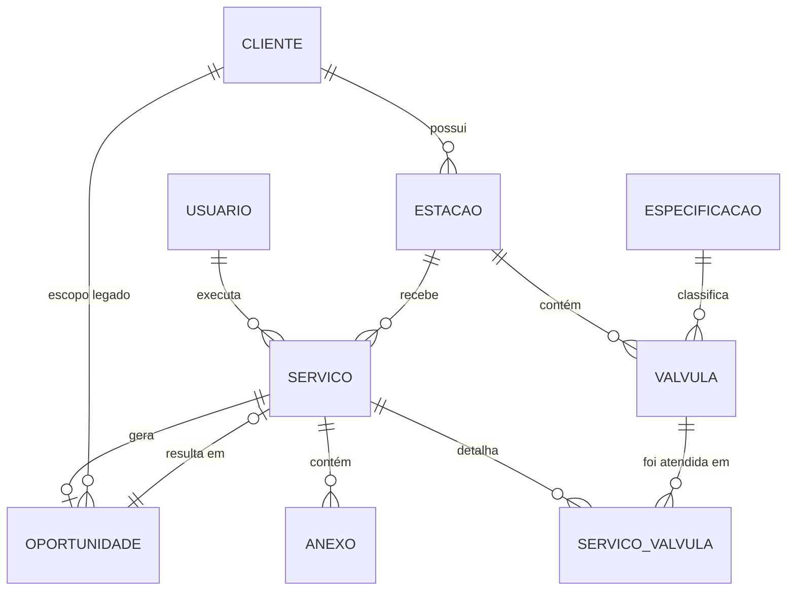
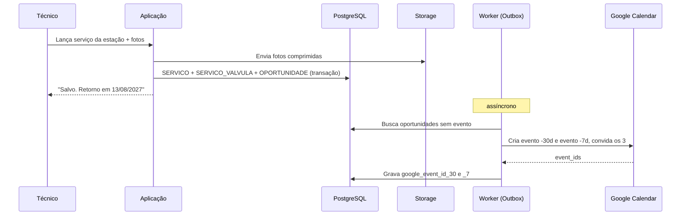

# Valtis — Documentação do Projeto (v0.3)

**Cliente:** Manutec Válvulas — manutenção hidráulica predial
**Autor da ideia:** Daniel Tabosa
**Data:** 13/08/2026
**Status:** Requisitos e arquitetura. Nenhuma linha de código escrita.

> **Mudança principal da v0.3:** o modelo de dados foi reescrito a partir das duas planilhas reais. Ganhou uma entidade nova (**Estação**), perdeu uma que não existia na prática (**Local**), e passou a usar exatamente os mesmos nomes de campo da planilha `Controle_Manutencao_VRP_Final`, para que a migração seja direta.

---

## Legenda de origem

| Marca | Significado |
|---|---|
| `[INFORMADO]` | Veio da descrição do Daniel |
| `[PLANILHA]` | Extraído das planilhas reais — **a fonte mais confiável deste documento** |
| `[DECIDIDO]` | Respondido nas rodadas de perguntas (D-01 a D-10) |
| `[SUGESTÃO]` | Proposta minha, ainda não validada. Pode ser cortada |
| `[A DEFINIR]` | Decisão pendente (capítulo 6) |

## Decisões fechadas

| # | Tema | Decisão |
|---|---|---|
| D-01 | Conta Google | **Gmail comum.** Agenda compartilhada da empresa, OAuth com refresh token |
| D-02 | Preenchimento | **Não precisa ser no local.** Offline sai do escopo |
| D-03 | ~~Antecedência~~ | *Substituída por D-08* |
| D-04 | Follow-up | Fila **sem dono fixo**; qualquer um dos 3 assume |
| D-05 | Recusa | Sistema **pergunta na hora** se e quando voltar a lembrar |
| D-06 | Base histórica | Existe. Duas planilhas fornecidas |
| D-07 | Estação redutora | **É um conjunto que contém várias VRPs.** Vira entidade própria |
| D-08 | Antecedência | **Dois alertas: 30 dias** (comercial) **e 7 dias** (lembrete final) |
| D-09 | Importação | **Só clientes + data da última manutenção.** Histórico intermediário não migra |
| D-10 | Pressões | Campo **opcional** no registro de serviço |

---

## 1. Visão geral e problema de negócio

### 1.1 A dor `[INFORMADO]`
A Manutec instala e mantém VRPs (válvulas redutoras de pressão) em prédios. Toda manutenção abre uma janela de reventa cerca de 12 meses depois. Hoje esse rastreamento é manual, feito em momentos vagos, garimpando registros antigos. Oportunidades vencem sem contato — **dinheiro na mesa**.

### 1.2 A proposta `[INFORMADO]`
Aplicação web onde o time registra o serviço executado. O sistema persiste em banco e cria automaticamente um agendamento no Google Calendar para o retorno de 12 meses.

### 1.3 O tamanho real do problema `[PLANILHA]`

A planilha `RELATORIO NF MANUTENCAO VALVULAS - CONSOLIDADO` quantifica a dor. **Isto deixou de ser hipótese:**

| Métrica | Valor |
|---|---|
| NFs de manutenção analisadas | **595** (2018 a ago/2026) |
| Clientes distintos atendidos | **296** |
| Clientes em situação **CRÍTICA** (≥ 24 meses sem manutenção) | **153** |
| Clientes **ATRASADOS** (≥ 12 meses) | **52** |
| Clientes em **ATENÇÃO** (≥ 8 meses) | **27** |
| Clientes **EM DIA** (< 8 meses) | **64** |
| Clientes recorrentes **sem nenhuma NF em 2026** | **94** |

**Leitura:** de 296 clientes já atendidos, **205 estão fora do ciclo de 12 meses** (69%). E 94 são clientes com histórico consolidado que simplesmente pararam de ser procurados. Essa é a lista que justifica o projeto inteiro — e ela já existe, pronta, hoje.

### 1.4 Volume operacional `[PLANILHA]` — resolve o item 6.7 da v0.2

| Ano | Válvula redutora | Estação redutora | Total | Clientes distintos |
|---|---|---|---|---|
| 2018 | 6 | 0 | 6 | 5 |
| 2019 | 14 | 0 | 14 | 14 |
| 2020 | 45 | 6 | 51 | 44 |
| 2021 | 18 | 61 | 79 | 75 |
| 2022 | 20 | 52 | 72 | 70 |
| 2023 | 32 | 64 | 96 | 89 |
| 2024 | 35 | 71 | 106 | 98 |
| 2025 | 52 | 51 | 103 | 83 |
| 2026 (jan–ago) | 30 | 38 | 68 | 57 |
| **Total** | **252** | **343** | **595** | **296** |

**Consequências para a arquitetura:**

- O volume é de **~100 atendimentos/ano**, cerca de 8 por mês. Isso é *pequeno* em termos computacionais e confirma que a stack proposta é folgada. Nenhuma decisão precisa ser tomada por desempenho.
- **Estação redutora (343) supera Válvula redutora (252)** e é a maior parte do faturamento. Um sistema que só modelasse VRP individual ignoraria a maioria da receita. Isto motivou o D-07.
- O crescimento é estável (~100/ano desde 2023), sem sinal de explosão de volume.

### 1.5 Objetivo mensurável `[SUGESTÃO]`

| Indicador | Situação hoje | Meta |
|---|---|---|
| Clientes fora do ciclo de 12 meses | 205 de 296 (69%) | ≤ 20% em 12 meses |
| Clientes recorrentes sem contato no ano | 94 | ≤ 10 |
| % de retornos contatados dentro da janela | não medido | ≥ 90% |
| Tempo para lançar um atendimento | não medido | ≤ 3 minutos |

### 1.6 Fora de escopo `[PLANILHA]` + `[SUGESTÃO]`
A própria planilha já declara fora de escopo: *"peças de reposição padrão e faixa de complexidade de orçamento por especificação"*. Mantenho, e acrescento: nota fiscal, financeiro, estoque, roteirização, portal do cliente e app nativo em loja.

---

## 2. Usuários e perfis

**3 pessoas** com permissão de preencher, usando celular em campo e PC no escritório `[INFORMADO]`.

| Perfil | Pode | Não pode |
|---|---|---|
| **Técnico** | Lançar e editar serviços, anexar fotos, consultar histórico, assumir oportunidades da fila | Excluir registros, alterar configurações |
| **Administrador** | Tudo do técnico + cadastros, edição/inativação de qualquer registro, gestão de usuários, painel gerencial, importação | — |

Técnicos identificados na planilha `[PLANILHA]`: Josenildo Barbosa, Anderson Melo da Silva. (São dados fictícios, mas indicam que o campo `tecnico_responsavel` é texto/seleção de usuário.)

`[A DEFINIR]` As 3 pessoas são todas de campo, ou alguém é só de escritório?

---

## 3. Requisitos Funcionais

**P0** = MVP · **P1** = próxima entrega · **P2** = desejável

### 3.1 Acesso

| ID | Requisito | Prio | Origem |
|---|---|---|---|
| RF-01 | Login individual antes de qualquer acesso a dados | P0 | `[SUGESTÃO]` |
| RF-02 | Sessão longa no celular, sem relogin constante | P0 | `[SUGESTÃO]` |
| RF-03 | Administrador gerencia os usuários | P1 | `[SUGESTÃO]` |
| RF-04 | Todo registro guarda `criado_em`, `atualizado_em` e autor | P0 | `[PLANILHA]` — colunas já existem |

### 3.2 Cadastros

| ID | Requisito | Prio | Origem |
|---|---|---|---|
| RF-05 | Cadastrar **cliente** (condomínio) com código de referência, endereço, bairro, cidade, síndico, telefone, e-mail, tipo de atendimento e status de contrato | P0 | `[PLANILHA]` |
| RF-06 | Cadastrar **especificação técnica** no catálogo: marca + modelo + diâmetro + tipo de registro. Cadastra-se uma vez e várias válvulas reutilizam | P0 | `[PLANILHA]` |
| RF-07 | Cadastrar **estação** (ponto de instalação) com localização, andar inicial, andar final e se exige fechamento geral | P0 | `[PLANILHA]` + D-07 |
| RF-08 | Cadastrar **válvula** vinculada a uma estação, com número (01/02), especificação, número de série, data de instalação e periodicidade | P0 | `[PLANILHA]` |
| RF-09 | Gerar automaticamente o `codigo_referencia` no padrão `COND-001-VRP-01` | P0 | `[PLANILHA]` |
| RF-10 | Criar cliente / estação / válvula **de dentro do formulário de lançamento**, sem trocar de tela | P0 | `[SUGESTÃO]` |
| RF-11 | Buscar por nome do condomínio, código de referência, bairro ou número de série | P0 | `[SUGESTÃO]` |
| RF-12 | **Inativar** (nunca excluir) cliente, estação ou válvula. Inativos saem do painel e permanecem no histórico | P0 | `[PLANILHA]` — *"Nunca apagar linhas. Marcar ativo = 'Não'"* |
| RF-13 | Alertar duplicidade ao cadastrar válvula com mesma estação e mesmo número | P1 | `[PLANILHA]` — coluna `alerta_duplicidade` |

### 3.3 Registro de serviço

| ID | Requisito | Prio | Origem |
|---|---|---|---|
| RF-14 | Lançar manutenção com **data realizada**, tipo (Preventiva/Corretiva), técnico responsável, peças substituídas e observações | P0 | `[PLANILHA]` |
| RF-15 | O lançamento é feito **por estação**, marcando quais válvulas foram atendidas — não uma tela por válvula | P0 | `[SUGESTÃO]` — ver 5.3, evidência forte na planilha |
| RF-16 | Registrar pressão de entrada e saída como **campos opcionais**, por válvula | P1 | `[DECIDIDO]` · D-10 |
| RF-17 | A **data realizada é sempre informada**, nunca assumida como a data de preenchimento | P0 | D-02 |
| RF-18 | Nunca sobrescrever registro antigo — toda intervenção é uma linha nova | P0 | `[PLANILHA]` |
| RF-19 | Anexar fotos pela **câmera ou pela galeria**, com compressão no dispositivo | P0 | `[DECIDIDO]` + D-02 |
| RF-20 | Salvar como rascunho e concluir depois | P1 | `[SUGESTÃO]` |
| RF-21 | Ver o histórico completo de uma válvula e de uma estação em ordem cronológica | P1 | `[SUGESTÃO]` |
| RF-22 | Apontar atendimentos executados e ainda não lançados após X dias | P2 | `[SUGESTÃO]` — mitiga o risco 6.9 |

### 3.4 Recorrência e Google Calendar

| ID | Requisito | Prio | Origem |
|---|---|---|---|
| RF-23 | `data_proxima_manutencao = ultima_manutencao + periodicidade_meses` (padrão **12**) | P0 | `[INFORMADO]` + `[PLANILHA]` |
| RF-24 | Periodicidade editável **por válvula**, apenas para exceções pontuais | P0 | `[PLANILHA]` — resolve o item 6.5 da v0.2 |
| RF-25 | Tipo de atendimento (Contrato/Avulso) **não altera** o cálculo de prazo | P0 | `[PLANILHA]` |
| RF-26 | Criar evento na agenda da empresa **30 dias antes** do vencimento — alerta comercial | P0 | `[DECIDIDO]` · D-08 |
| RF-27 | Criar segundo evento **7 dias antes** — lembrete final | P0 | `[DECIDIDO]` · D-08 |
| RF-28 | Ambas as antecedências configuráveis num único lugar | P1 | `[PLANILHA]` — parâmetro editável na aba `legenda_regras` |
| RF-29 | Evento traz condomínio, código de referência, localização da estação, andares atendidos, **se exige fechamento geral**, data da última manutenção e link para o registro | P0 | `[SUGESTÃO]` |
| RF-30 | Convidar os 3 usuários no evento | P0 | `[DECIDIDO]` · D-01 |
| RF-31 | Falha na API do Google **não impede** o salvamento; agendamento entra em fila de reprocessamento | P0 | `[SUGESTÃO]` — ver 7.3 |
| RF-32 | Editar data ou inativar equipamento atualiza/remove os eventos correspondentes | P1 | `[SUGESTÃO]` |
| RF-33 | Painel mostra o que não conseguiu sincronizar com o Calendar | P1 | `[SUGESTÃO]` |

### 3.5 Painel de status

| ID | Requisito | Prio | Origem |
|---|---|---|---|
| RF-34 | Painel calculado, **não editável**, com uma linha por válvula ativa | P0 | `[PLANILHA]` |
| RF-35 | Classificar em **VENCIDO · PRÓXIMO DO VENCIMENTO · EM DIA · SEM REGISTRO** | P0 | `[PLANILHA]` |
| RF-36 | Exibir `dias_restantes` (negativo quando vencido) | P0 | `[PLANILHA]` |
| RF-37 | Destacar **SEM REGISTRO**: válvula cadastrada sem nenhuma manutenção lançada, sem data-base para calcular vencimento | P0 | `[PLANILHA]` |
| RF-38 | Filtrar por cliente, bairro, status, técnico, período, tipo de atendimento | P0 | `[DECIDIDO]` |
| RF-39 | Resumo com a contagem por situação | P0 | `[PLANILHA]` |
| RF-40 | Exportar a listagem filtrada para Excel/CSV | P2 | `[SUGESTÃO]` |

### 3.6 Pipeline de oportunidades

| ID | Requisito | Prio | Origem |
|---|---|---|---|
| RF-41 | Marcar desfecho: contatado / aceito / recusado / executado / perdido | P1 | `[SUGESTÃO]` |
| RF-42 | Oportunidade nasce **sem dono**; qualquer usuário assume com um toque | P1 | `[DECIDIDO]` · D-04 |
| RF-43 | Destacar oportunidade vencendo **sem ninguém ter assumido** | P1 | `[SUGESTÃO]` — indispensável dado o D-04 |
| RF-44 | Ao marcar `recusado`, **perguntar** se e quando voltar a lembrar | P1 | `[DECIDIDO]` · D-05 |
| RF-45 | Registrar motivo da recusa em lista curta | P2 | `[SUGESTÃO]` |
| RF-46 | Ao lançar a manutenção da reventa, fechar a oportunidade e abrir novo ciclo | P1 | `[SUGESTÃO]` |
| RF-47 | Dashboard: oportunidades no período, taxa de conversão, clientes recuperados | P2 | `[SUGESTÃO]` |

### 3.7 Relatório em PDF

| ID | Requisito | Prio | Origem |
|---|---|---|---|
| RF-48 | PDF do serviço com logo, dados do condomínio, estação, válvulas atendidas, peças, observações e data do próximo retorno | P1 | `[DECIDIDO]` |
| RF-49 | Compartilhar direto do celular (WhatsApp/e-mail) | P1 | `[SUGESTÃO]` |
| RF-50 | Enviar por e-mail ao cliente de dentro do sistema | P2 | `[SUGESTÃO]` |

### 3.8 Importação da base real

| ID | Requisito | Prio | Origem |
|---|---|---|---|
| RF-51 | Importar os **296 clientes** com a **data da última manutenção**, a partir da aba `Matriz Cliente x Ano` / `Alertas` | P0 | `[DECIDIDO]` · D-09 |
| RF-52 | Não importar as 595 intervenções individuais | P0 | `[DECIDIDO]` · D-09 |
| RF-53 | Clientes importados entram **sem estação e sem válvula cadastradas**, com marcação visual de "cadastro incompleto" | P0 | `[SUGESTÃO]` — consequência inevitável do D-09 |
| RF-54 | Gerar oportunidade **no nível do cliente** para importados, já classificada como VENCIDO quando aplicável | P0 | `[SUGESTÃO]` |
| RF-55 | **Não criar eventos retroativos** no Calendar para vencimentos passados; eles aparecem no painel como lista de ação imediata | P0 | `[SUGESTÃO]` — criar 205 eventos no passado inutilizaria a agenda |
| RF-56 | Pré-visualizar, apontar linhas problemáticas e permitir correção antes de gravar | P0 | `[SUGESTÃO]` |
| RF-57 | Deduplicação assistida de nomes de cliente | P0 | `[PLANILHA]` — ver risco 6.2 |
| RF-58 | Marcar a data importada como **aproximada** | P0 | `[PLANILHA]` — ver risco 6.1 |
| RF-59 | Ao lançar a primeira manutenção real de um cliente importado, o cadastro é completado e ele sai do estado "incompleto" | P1 | `[SUGESTÃO]` |

---

## 4. Requisitos Não Funcionais

### 4.1 Usabilidade — o requisito mais crítico
Se lançar for chato, o sistema morre e a empresa volta para a planilha.

| ID | Requisito |
|---|---|
| RNF-01 | Responsiva: mesma aplicação em celular e PC `[INFORMADO]` |
| RNF-02 | Preenchível com uma mão; alvos de toque ≥ 44px `[SUGESTÃO]` |
| RNF-03 | Lançamento completo em ≤ 3 minutos `[SUGESTÃO]` |
| RNF-04 | Instalável como PWA na tela inicial `[SUGESTÃO]` |
| RNF-05 | Teclado numérico automático em campos numéricos; seletor nativo de data `[SUGESTÃO]` |
| RNF-06 | Listas suspensas com os valores fixos da planilha, nunca texto livre `[PLANILHA]` |
| RNF-07 | Interface em português do Brasil `[SUGESTÃO]` |

### 4.2 Conectividade
D-02 removeu a necessidade de offline. O sistema pode assumir conexão disponível.

| ID | Requisito |
|---|---|
| RNF-08 | Perda momentânea de conexão não apaga o que já foi digitado `[SUGESTÃO]` |
| RNF-09 | Upload de fotos com progresso e nova tentativa `[SUGESTÃO]` |
| RNF-10 | ~~Sincronização offline~~ — **fora do escopo** `[DECIDIDO]` · D-02 |

### 4.3 Desempenho e escala
Calibrado pelos números reais de 1.4, não por estimativa.

| ID | Requisito |
|---|---|
| RNF-11 | Suportar 3 usuários simultâneos; até 20 sem mudança de arquitetura `[SUGESTÃO]` |
| RNF-12 | Volume esperado: ~300 clientes, ~1.200 válvulas, ~100 serviços/ano. Em 10 anos, poucos milhares de linhas — **irrelevante para qualquer banco moderno** `[PLANILHA]` |
| RNF-13 | Carregamento inicial em 3G ≤ 5s; navegação ≤ 1s `[SUGESTÃO]` |

### 4.4 Confiabilidade

| ID | Requisito |
|---|---|
| RNF-14 | Falha do Google **nunca** causa perda de registro `[SUGESTÃO]` |
| RNF-15 | Backup diário automático, retenção ≥ 30 dias, restauração testada `[SUGESTÃO]` |
| RNF-16 | Exclusão sempre lógica (`ativo = Não`) `[PLANILHA]` |
| RNF-17 | Trilha de auditoria de criação, alteração e inativação `[SUGESTÃO]` |
| RNF-18 | Disponibilidade alvo 99% em horário comercial `[SUGESTÃO]` |

### 4.5 Segurança e conformidade

| ID | Requisito |
|---|---|
| RNF-19 | HTTPS em todo o tráfego `[SUGESTÃO]` |
| RNF-20 | Senhas com hash forte; nenhum segredo no repositório `[SUGESTÃO]` |
| RNF-21 | Refresh token do Google cifrado, fora do código, com alerta se for revogado `[SUGESTÃO]` |
| RNF-22 | LGPD: o sistema guardará nome, telefone e e-mail de **296 síndicos e administradoras**. Exige base legal, finalidade declarada e política de retenção `[SUGESTÃO]` |
| RNF-23 | Nenhuma tela pública com dado de cliente `[SUGESTÃO]` |

### 4.6 Manutenibilidade e custo

| ID | Requisito |
|---|---|
| RNF-24 | Uma linguagem no front e no back `[SUGESTÃO]` |
| RNF-25 | Deploy automatizado a partir do Git `[SUGESTÃO]` |
| RNF-26 | Custo de infraestrutura ≤ R$ 150/mês na fase inicial `[SUGESTÃO]` |
| RNF-27 | Dados integralmente exportáveis, sem lock-in `[SUGESTÃO]` |
| RNF-28 | Nomes de campo idênticos aos da planilha, para migração 1:1 e leitura direta pela equipe `[SUGESTÃO]` |

---

## 5. Entidades e relacionamentos

### 5.1 O que mudou em relação à v0.2 — e por quê

**Saiu: LOCAL.** Eu tinha proposto `Cliente → Local → Válvula`, supondo que um cliente pudesse ter vários prédios. A planilha mostra que **cliente e condomínio são a mesma coisa** — `nome_condominio`, `endereco`, `bairro` e `cidade` estão todos na aba `clientes`, uma linha por prédio. Manter LOCAL seria uma camada vazia. Removida.

**Entrou: ESTAÇÃO.** Duas evidências independentes:

1. **D-07:** você confirmou que estação redutora é um conjunto que contém várias VRPs.
2. **A planilha já modela estações sem saber.** Observe as válvulas do Edifício Costa Azul:

| Código | Localização | Andares | Nº | Última manutenção | Técnico |
|---|---|---|---|---|---|
| COND-001-VRP-01 | Barrilete - Casa de bombas | 0 ao 4 | 01 | 10/03/2025 | Josenildo |
| COND-001-VRP-02 | Barrilete - Casa de bombas | 0 ao 4 | 02 | 10/03/2025 | Josenildo |
| COND-001-VRP-03 | Shaft hidráulico - 5º pav. | 5 ao 12 | 01 | 20/08/2025 | Anderson |
| COND-001-VRP-04 | Shaft hidráulico - 5º pav. | 5 ao 12 | 02 | 20/08/2025 | Anderson |

Os pares repetem **localização, faixa de andares e `requer_fechamento_geral`**, diferem só no `numero_valvula`, e foram atendidos **na mesma data pelo mesmo técnico**. Isso é uma estação com duas válvulas em paralelo — exatamente o que a regra de numeração descreve (*"01 = a da ESQUERDA, quando dispostas em PARALELO"*). Promover a estação a entidade elimina a repetição e reflete como o serviço realmente acontece.

**Entrou: ESPECIFICAÇÃO como catálogo.** Na v0.2 marca, modelo e diâmetro eram campos soltos na válvula. A planilha usa um catálogo reutilizável (`catalogo_especificacoes`). É melhor: evita "Bermad 720" e "bermad 720" virarem coisas diferentes.

### 5.2 Diagrama



### 5.3 Decisão de modelagem: o serviço é lançado **por estação**

`[SUGESTÃO — precisa da sua confirmação]`

Na planilha, `historico_manutencoes` tem uma linha por válvula. Mas os dados mostram que as válvulas de uma mesma estação são sempre atendidas juntas, na mesma data, pelo mesmo técnico. Se o formulário exigisse um lançamento por válvula, um prédio com 8 válvulas em 4 estações geraria **8 preenchimentos** para 4 visitas.

**Proposta:** um `SERVICO` por estação/visita, com marcação de quais válvulas foram atendidas e detalhe opcional por válvula (peças, pressões). Isso corta o esforço de lançamento pela metade ou mais — e o esforço de lançamento é o maior risco de adoção do projeto (6.9).

Também explica por que "Estação redutora" domina as NFs: **vocês faturam a estação, não a válvula.** O sistema deve espelhar isso.

*Se na prática as válvulas de uma estação forem atendidas em datas diferentes com frequência, esta decisão cai e voltamos ao lançamento por válvula.*

### 5.4 Dicionário de entidades

Nomes de campo idênticos aos da planilha (RNF-28).

**USUARIO** — as 3 pessoas.
`id` · `nome` · `email` · `senha_hash` · `perfil` (tecnico | admin) · `ativo` · `criado_em`

**CLIENTE** — o condomínio. `[PLANILHA: aba clientes]`
`id_cliente` · `codigo_referencia` (COND-001) · `nome_condominio` · `endereco` · `bairro` · `cidade` · `sindico_responsavel` · `telefone_contato` · `email_contato` · `tipo_atendimento` (Contrato | Avulso) · `status_contrato` (Ativo | Suspenso | Inativo) · `ativo` (Sim | Não) · `origem` (sistema | importacao) · `ultima_manutencao_legado` · `data_legado_aproximada` (booleano) · `cadastro_incompleto` (booleano) · `criado_em` · `atualizado_em`

**ESPECIFICACAO** — catálogo técnico. `[PLANILHA: catalogo_especificacoes]`
`id_especificacao` · `marca` · `modelo` · `diametro_polegadas` · `tipo_registro` (Esfera | Gaveta) · `descricao_completa` (calculada) · `ativo`

**ESTACAO** — ponto de instalação. `[D-07 + PLANILHA]`
`id_estacao` · `id_cliente` → CLIENTE · `localizacao_instalacao` · `andar_inicial` · `andar_final` · `requer_fechamento_geral` (Sim | Não) · `ativo` · `criado_em` · `atualizado_em`

> `andar_inicial`: térreo = **0**; subsolo = negativo (-1, -2) `[PLANILHA]`

**VALVULA** — o equipamento físico. `[PLANILHA: aba equipamentos]`
`id_equipamento` · `id_estacao` → ESTACAO · `id_especificacao` → ESPECIFICACAO · `codigo_referencia_equipamento` (COND-001-VRP-01) · `numero_valvula` (01 | 02) · `numero_serie` · `data_instalacao` · `periodicidade_meses` (padrão **12**) · `ativo` · `criado_em` · `atualizado_em`

> `numero_valvula` `[PLANILHA]`: **01** = a da esquerda quando em paralelo, ou a de cima quando sobrepostas. **02** = a segunda. Válvula única = **01**.

**SERVICO** — a intervenção. `[PLANILHA: historico_manutencoes]`
`id_manutencao` · `id_estacao` → ESTACAO · `data_realizada` · `tipo_manutencao` (Preventiva | Corretiva) · `tecnico_responsavel` → USUARIO · `observacoes` · `status` (rascunho | concluido) · `criado_por` · `criado_em` · `atualizado_em`

**SERVICO_VALVULA** — detalhe por válvula atendida. `[SUGESTÃO — decorre de 5.3]`
`id` · `id_manutencao` → SERVICO · `id_equipamento` → VALVULA · `pecas_substituidas` · `pressao_entrada` *(opcional, D-10)* · `pressao_saida` *(opcional, D-10)* · `observacao_especifica`

**ANEXO** — fotos.
`id` · `id_manutencao` → SERVICO · `id_equipamento` *(opcional)* · `caminho_arquivo` · `tipo_mime` · `tamanho_bytes` · `legenda` · `criado_em`

**OPORTUNIDADE** — o retorno e seu desfecho comercial.
`id` · `escopo` (**valvula** | **cliente**) · `id_equipamento` *(nulo quando escopo = cliente)* · `id_cliente` · `id_manutencao_origem` *(nulo se importado)* · `data_prevista` · `data_alerta_30` · `data_alerta_7` · `status` · `responsavel_id` *(nulo até alguém assumir)* · `assumida_em` · `motivo_recusa` · `origem` (sistema | importacao) · `google_event_id_30` · `google_event_id_7` · `sincronizado_em` · `tentativas_sync` · `notas` · `id_manutencao_resultante`

> O campo `escopo` é o que permite o D-09 funcionar: os 296 clientes importados geram oportunidades **de escopo cliente**, sem válvula vinculada, porque essa informação não existe na base real.

**AUDITORIA**
`id` · `usuario_id` · `entidade` · `entidade_id` · `acao` · `dados_antes` · `dados_depois` · `criado_em`

### 5.5 Regras de negócio

| ID | Regra | Origem |
|---|---|---|
| RN-01 | `data_proxima_manutencao = data_realizada + periodicidade_meses` (padrão 12) | `[INFORMADO]` + `[PLANILHA]` |
| RN-02 | Periodicidade é 12 meses para toda VRP, independentemente de marca, modelo ou de o cliente ser contrato ou avulso. Editável por válvula só em exceções | `[PLANILHA]` |
| RN-03 | `tipo_atendimento` é informação **comercial** e não altera o cálculo de prazo | `[PLANILHA]` |
| RN-04 | Status do painel: **VENCIDO** (dias_restantes < 0) · **PRÓXIMO DO VENCIMENTO** (dentro da janela de 30 dias) · **EM DIA** · **SEM REGISTRO** (nenhuma manutenção lançada) | `[PLANILHA]` |
| RN-05 | Válvula **SEM REGISTRO** não tem data-base e por isso não gera oportunidade automática — entra numa lista de pendência de cadastro | `[PLANILHA]` + `[SUGESTÃO]` |
| RN-06 | Dois eventos por ciclo: 30 dias antes (comercial) e 7 dias antes (lembrete final) | `[DECIDIDO]` · D-08 |
| RN-07 | Todo SERVICO concluído gera uma OPORTUNIDADE de escopo válvula, **sem responsável** | `[SUGESTÃO]` + D-04 |
| RN-08 | Qualquer usuário assume uma oportunidade da fila; o nome de quem assumiu fica visível | `[DECIDIDO]` · D-04 |
| RN-09 | Ao marcar `recusado`, perguntar se e quando voltar a lembrar. Se sim, nova oportunidade; se não, encerra até reativação manual | `[DECIDIDO]` · D-05 |
| RN-10 | Novo SERVICO fecha as oportunidades abertas da estação e inicia novo ciclo | `[SUGESTÃO]` |
| RN-11 | Nada é excluído. Inativação lógica em todas as entidades | `[PLANILHA]` |
| RN-12 | Válvula ou cliente inativo não gera novas oportunidades | `[PLANILHA]` + `[SUGESTÃO]` |
| RN-13 | Registros importados não geram eventos retroativos no Calendar | `[SUGESTÃO]` |
| RN-14 | `codigo_referencia_equipamento` = `codigo_referencia` do cliente + `-VRP-` + sequencial | `[PLANILHA]` |

---

## 6. Riscos e decisões pendentes

### 6.1 🔴 As datas da base real são aproximadas
A própria planilha avisa: *"Data = data de modificação do arquivo; pode diferir da data de emissão impressa na NF."*

**Impacto:** todo o cálculo de vencimento dos 296 clientes importados parte de uma data que pode estar deslocada — possivelmente por meses, já que arquivos podem ter sido movidos ou reorganizados.

**Mitigação:** marcar essas datas como aproximadas (RF-58) e exibir no painel um indicador de baixa confiança. Na prática isso importa pouco para os 153 clientes CRÍTICOS — quem está há 24+ meses sem manutenção precisa de contato de qualquer forma, errar por 3 meses não muda a ação. Importa para quem está perto da janela.

### 6.2 🔴 Nomes de cliente inconsistentes na base real
Amostras: `02 OPERA CLASSIC`, `02 TSAR`, `1976ED CAIS DA AURORA`. Os prefixos numéricos são resíduo de nome de pasta ou arquivo, não parte do nome. Há forte chance de o mesmo condomínio aparecer com grafias diferentes entre as bases `RECIBOS` (409 NFs) e `MANUTEC VRP` (186 NFs).

**Impacto:** importar sem tratar significa cadastrar o mesmo cliente duas vezes e agendar retorno duplicado — o sistema nasce com o defeito que veio corrigir.

**Mitigação:** RF-57, deduplicação assistida. O sistema agrupa nomes parecidos e **você decide** o que é o mesmo cliente. Não pode ser automático.

### 6.3 🟠 Os 296 clientes importados entram sem válvula cadastrada
Consequência direta do D-09: a base real não tem informação de equipamento. Esses clientes ficam num estado "cadastro incompleto" — geram oportunidade de contato, mas não aparecem no painel por válvula.

**Isso é aceitável e provavelmente correto:** o cadastro de válvula se completa na próxima visita, quando o técnico está na frente do equipamento. Forçar o preenchimento agora, de memória ou de papel, produziria dado ruim.

`[A DEFINIR]` Deve haver duas telas separadas (painel de válvulas × lista de clientes a contatar), ou uma visão unificada?

### 6.4 🟠 Estação redutora ainda precisa de detalhamento
D-07 definiu que é um conjunto de VRPs. Faltam os detalhes operacionais:

- Uma estação tem sempre 2 válvulas, ou pode ter 3, 4 ou mais? A planilha só permite `numero_valvula` = 01 ou 02.
- O serviço em uma estação inclui outros componentes além das válvulas — filtro Y, manômetros, registros de bloqueio? Se sim, o escopo do serviço precisa listá-los.
- A periodicidade de 12 meses é da válvula ou da estação?

### 6.5 🟠 A relação Contrato × Avulso está estranha nos dados
Todos os clientes de exemplo da planilha são `Avulso`. Mas 595 NFs em 296 clientes dá média de 2 atendimentos por cliente em 8 anos — muito baixo para um negócio recorrente.

**Pergunta:** existe um grupo de clientes sob contrato que **não** aparece nessas NFs (por serem faturados de outra forma)? Se sim, falta uma parte relevante da base.

### 6.6 🟡 Identificação física da válvula em campo
Com até 20 válvulas por prédio, como o técnico sabe qual é qual? Existe plaqueta ou etiqueta física? A regra 01/02 (esquerda/direita, cima/baixo) resolve dentro da estação, mas não identifica a estação. Vale QR Code? `[SUGESTÃO]`

### 6.7 🟡 Valores e orçamento
A planilha declara "faixa de complexidade de orçamento" fora de escopo. Confirmo que o sistema **não** guarda valor cobrado na v1? Sem isso, o indicador de "receita recuperada" (RF-47) não é calculável — só a contagem de oportunidades convertidas.

### 6.8 🟡 Custo, hospedagem e domínio
Teto de custo mensal? Preferência por dados no Brasil? Existe domínio da Manutec para hospedar num subdomínio?

### 6.9 🔴 Adoção — o maior risco do projeto
Não é técnico. Com o D-02, lançar deixou de ser parte do atendimento e virou tarefa administrativa separada — e tarefa separada é tarefa adiada.

Mitigações em ordem de eficácia:

1. **Dar algo em troca imediato:** o PDF do relatório (RF-48). O técnico preenche porque sai dali com o documento pronto para o síndico.
2. **Lançamento por estação** (5.3), que reduz drasticamente o número de preenchimentos.
3. Formulário de ≤ 3 minutos (RNF-03).
4. Rotina fixa de lançamento acordada entre os 3.
5. RF-22: o sistema aponta o que está pendente de lançamento.

### 6.10 🟡 Ponto único de falha na conta Google
A conta Gmail dona da agenda concentra o risco. Deve ser institucional, não pessoal, com recuperação configurada e credenciais em cofre acessível a mais de uma pessoa.

### 6.11 🟡 Dependência de uma pessoa
Sistema feito por um autor, com dados de negócio relevantes. Mitigação: repositório na conta da empresa, documentação viva, exportação periódica, credenciais compartilhadas.

### 6.12 🟡 LGPD
296 contatos de síndicos e administradoras. Requer finalidade declarada, base legal e prazo de retenção.

---

## 7. Arquitetura

### 7.1 Princípio
Um desenvolvedor, três usuários, ~100 registros por ano. **Microsserviços e Kubernetes seriam autossabotagem.** A escolha é um **monolito modular**: um projeto, módulos com fronteiras claras, extraível no futuro se algum dia fizer sentido.

### 7.2 Camadas

```
┌──────────────────────────────────────────────────────┐
│  Cliente — navegador (celular + PC), PWA instalável  │
│  Lançamento · Painel de status · Fila · Cadastros    │
└───────────────────────┬──────────────────────────────┘
                        │ HTTPS
┌───────────────────────▼──────────────────────────────┐
│  APLICAÇÃO (monolito modular)                        │
│                                                      │
│  Apresentação — telas e rotas                        │
│  ─────────────────────────────────────────────────   │
│  Casos de uso — regras RN-01..14                     │
│    lancarServico · calcularStatusPainel ·            │
│    gerarOportunidade · assumirOportunidade ·         │
│    fecharCiclo · emitirRelatorio · importarLegado    │
│  ─────────────────────────────────────────────────   │
│  Adaptadores — Repositórios · Calendar · Storage     │
│                · PDF · Planilha                      │
└──────┬─────────────────┬──────────────┬──────────────┘
       │                 │              │
┌──────▼──────┐  ┌───────▼──────┐  ┌────▼─────────────┐
│ PostgreSQL  │  │ Object       │  │ Google Calendar  │
│             │  │ Storage      │  │ (via Outbox)     │
└─────────────┘  └──────────────┘  └──────────────────┘
```

Regra de ouro: **os casos de uso não conhecem o Google, nem o Postgres, nem o storage.** Falam com interfaces. Mantém a regra de negócio testável e permite trocar provedor sem reescrever o núcleo (RNF-27).

### 7.3 Padrão Outbox para o Calendar
O ponto arquitetural mais importante, e o que atende o RNF-14.

**Errado:** salvar o serviço e chamar a API do Google na mesma requisição. Google lento ou token vencido = erro na tela do técnico e risco de perder o dado mais valioso do sistema.

**Certo:**

1. Numa transação, grava `SERVICO`, `SERVICO_VALVULA` e `OPORTUNIDADE` com `google_event_id = null`.
2. Responde "salvo" imediatamente. A responsabilidade do técnico acaba aqui.
3. Um processo em segundo plano cria os dois eventos (30 e 7 dias) e preenche os IDs.
4. Falhou? Incrementa `tentativas_sync` e tenta de novo. O painel mostra pendências (RF-33).

Benefício colateral: **o sistema continua funcionando se o Google Calendar sair do ar ou for descontinuado.** A fonte da verdade é o banco; o Calendar é conveniência de notificação.

### 7.4 Fluxo principal



### 7.5 Painel: calculado ou materializado?
A aba `painel_status` é 100% fórmula. No sistema, `dias_restantes` e `status` mudam sozinhos com a passagem do tempo.

**Recomendação `[SUGESTÃO]`:** calcular na consulta, em tempo real. Com ~1.200 válvulas, o custo é irrelevante e elimina toda uma classe de bug de "painel desatualizado". Materializar só se algum dia houver problema de desempenho — e não haverá.

---

## 8. Módulos

| # | Módulo | Responsabilidade | Fase |
|---|---|---|---|
| M1 | **Acesso** | Login, sessão, perfis | 1 |
| M2 | **Cadastros** | Cliente, Especificação, Estação, Válvula. Busca e criação inline | 1 |
| M3 | **Lançamento** | Formulário de serviço por estação, otimizado para celular. O módulo mais sensível | 1 |
| M4 | **Painel** | Status calculado, filtros, resumo, SEM REGISTRO | 1 |
| M5 | **Recorrência** | Cálculo de vencimento e geração de oportunidade (RN-01 a RN-07) | 1 |
| M6 | **Calendar** | Adaptador Google + worker de outbox + reprocessamento | 1 |
| M7 | **Importador** | Carga dos 296 clientes, deduplicação assistida, marcação de data aproximada | 1 |
| M8 | **Anexos** | Câmera, galeria, compressão, upload | 2 |
| M9 | **Relatórios** | PDF e compartilhamento | 2 |
| M10 | **Pipeline** | Fila, assumir, desfecho, recusa com pergunta, fechamento de ciclo | 3 |
| M11 | **Indicadores** | Conversão e clientes recuperados | 3 |
| M12 | **Administração** | Configurações, auditoria | 3 |

Dependências: M1 e M2 sustentam todos. M5 depende de M3. M6 e M4 dependem de M5. M7 depende de M2. M10 depende de M5.

---

## 9. Stack tecnológica

| Camada | Escolha | Por quê |
|---|---|---|
| **Linguagem** | TypeScript | Uma linguagem no front e no back (RNF-24). Tipos evitam erro bobo sem equipe de QA |
| **Framework** | Next.js (App Router) | Front e back no mesmo projeto, um deploy. Bom em celular por padrão. Ecossistema grande |
| **Banco** | PostgreSQL | Relacional é o ajuste natural para Cliente→Estação→Válvula→Serviço |
| **ORM** | Prisma | Schema declarativo, migrações versionadas. Reduz atrito para dev solo |
| **Infra de dados** | Supabase | Postgres gerenciado + storage de fotos + autenticação + backup num só lugar. Elimina três decisões. Dados exportáveis (é Postgres puro) |
| **Estilo** | Tailwind + shadcn/ui | Rápido, responsivo por padrão, componentes prontos |
| **PDF** | @react-pdf/renderer | JavaScript puro, sem Chromium no servidor. Mais leve e barato |
| **Fotos** | Compressão no navegador antes do upload | Economiza storage e dados móveis |
| **Planilha** | SheetJS | Leitura do arquivo de importação e exportação para Excel |
| **Calendar** | googleapis + OAuth com refresh token | D-01. Isolado atrás do outbox. Exige publicar o app OAuth em produção |
| **Worker** | Cron do provedor, a cada 5–15 min | Fila dedicada seria overkill para 100 registros/ano |
| **Hospedagem** | Vercel ou Railway | Deploy automático via Git. Atenção: plano gratuito da Vercel é para uso não comercial |
| **Segredos** | Variáveis de ambiente + cofre de senhas da empresa | O refresh token do Google é o segredo mais crítico |
| **Repositório** | GitHub na conta da empresa | Mitiga 6.11 |
| **Erros** | Sentry (gratuito) | Sem isso, você só descobre bug quando alguém reclama |

**Custo estimado** `[SUGESTÃO — confirmar preços atuais]`: hospedagem ~US$ 20/mês + banco/storage US$ 0–25/mês + domínio. Cabe no teto do RNF-26. Começa no gratuito.

### 9.1 Alternativas descartadas

| Alternativa | Por que não |
|---|---|
| **Manter na planilha** | É o concorrente mais sério e merece resposta honesta: a planilha já faz painel, status e regras. O que ela **não** faz: agendar no Calendar, guardar foto, gerar PDF, ser preenchida com conforto no celular, impedir duas pessoas de sobrescreverem a mesma célula, e manter auditoria. Se essas cinco coisas não importarem, a planilha basta |
| Google Forms + Sheets + Apps Script | Sai em dias e é barato, mas não sustenta relacionamento entre estação, válvula e histórico, nem fotos organizadas |
| App nativo | Duas bases de código, lojas, atualização lenta. Não se justifica para 3 usuários |
| Airtable / Notion | Custo por usuário, integração limitada com Calendar, lock-in |
| Laravel / Django | Ótimos, mas somam uma segunda linguagem ao front |
| MongoDB | O domínio é fortemente relacional |

---

## 10. Fases de implementação

### Fase 0 — Fundação (~1 semana)
- Definir 6.4, 6.5, 6.7 e 6.8.
- Criar a conta Gmail institucional e a agenda "Manutenções VRP", compartilhada com os 3.
- **Publicar o app OAuth em produção** no Google Cloud e validar com evento de teste real. Tem armadilhas — precisa estar provado antes de tudo.
- Repositório, projeto, banco e deploy vazio no ar.
- **Marco:** um evento criado pelo sistema aparece na agenda dos 3 celulares.

### Fase 1 — MVP e carga da base real (~4–5 semanas)
Tudo P0. Inclui o importador, que subiu de fase por causa do D-09 — ele ficou simples (296 linhas, dois campos) e é o que faz o sistema nascer útil.

- M1 Acesso · M2 Cadastros · M3 Lançamento por estação
- M5 Recorrência · M6 Calendar com outbox · M4 Painel de status
- **M7 Importador:** carga dos 296 clientes com deduplicação assistida
- **Marco:** no primeiro dia de uso o painel já mostra **153 clientes críticos e 94 recorrentes sem contato em 2026** — uma lista de trabalho imediata. A partir daqui a empresa para de perder oportunidade.
- **Validação obrigatória:** os 3 usando em atendimentos reais por 2 semanas antes de seguir.

### Fase 2 — Fotos e relatório (~2 semanas)
- M8 Anexos: câmera e galeria, compressão, upload.
- M9 Relatórios: PDF com identidade visual da Manutec, compartilhável pelo celular.
- **Marco:** o técnico envia o relatório ao síndico no fim do atendimento. É o item que faz o time *querer* usar o sistema — mitigação principal do risco 6.9.

### Fase 3 — Pipeline comercial (~2 semanas)
- M10: fila sem dono, assumir, desfecho, recusa com pergunta, fechamento de ciclo.
- M11: conversão e clientes recuperados.
- M12: configurações e auditoria.
- **Marco:** responder "quantos clientes recuperamos este trimestre?" com um número.

### Fase 4 — Refinamentos (sob demanda)
- Exportações, QR Code na válvula, notificação por WhatsApp.
- Reavaliar as janelas de 30 e 7 dias com dados reais.
- Completar o cadastro de válvulas dos clientes importados, conforme as visitas acontecem.

> **Estimativas** `[SUGESTÃO]` são ordem de grandeza para sequenciamento, não compromisso de prazo.

---

## 11. Próximos passos

1. **Você:** responder 6.4 (detalhes da estação redutora — quantas válvulas, que componentes, periodicidade de quem) e 6.5 (existe base de clientes sob contrato fora dessas NFs?).
2. **Você:** confirmar ou derrubar a decisão 5.3 — lançamento por estação em vez de por válvula. É a que mais afeta o esforço diário do time.
3. **Você:** responder 6.7 (valor cobrado entra?) e 6.8 (custo, domínio).
4. **Nós:** revisar e **cortar** os `[SUGESTÃO]` que não fizerem sentido. Escopo menor entra em produção mais rápido.
5. **Depois:** desenhar o fluxo de telas da Fase 1, com foco no formulário de lançamento. Só então escrever código.

---

## Apêndice A — Rastreabilidade das planilhas

| Origem | O que forneceu |
|---|---|
| `Controle_Manutencao_VRP_Final.xlsx` · `legenda_regras` | Periodicidade de 12 meses, janela de alerta, regra 01/02, convenção de andares, soft delete, listas de valores, escopo excluído |
| · `clientes` | Estrutura de CLIENTE |
| · `catalogo_especificacoes` | Entidade ESPECIFICACAO |
| · `equipamentos` | Estrutura de VALVULA e evidência da ESTACAO |
| · `historico_manutencoes` | Estrutura de SERVICO |
| · `painel_status` | Vocabulário de status e RF-34 a RF-39 |
| `RELATORIO NF...CONSOLIDADO.xlsx` · `NFs` | 595 registros, 296 clientes, tipos de serviço, ressalva sobre datas |
| · `Alertas` | 153 críticos, 52 atrasados, 27 atenção, 64 em dia, 94 recorrentes sem contato |
| · `Matriz Cliente x Ano` | Base da importação (RF-51) |
| · `Resumo Anual` | Volume por ano, dimensionamento (RNF-12) |

## Apêndice B — Glossário

| Termo | Significado |
|---|---|
| **VRP** | Válvula Redutora de Pressão |
| **Estação redutora** | Conjunto que contém várias VRPs, geralmente em paralelo, atendendo uma faixa de andares |
| **Barrilete** | Tubulação de distribuição, normalmente na casa de bombas |
| **Shaft** | Prumada vertical de tubulação |
| **Fechamento geral** | Necessidade de interromper o abastecimento do prédio para executar o serviço |
| **PWA** | Site que instala como aplicativo na tela inicial do celular |
| **Outbox** | Padrão em que a integração externa é gravada no banco e executada depois, em segundo plano |
| **Soft delete** | Inativação lógica; o registro permanece no banco |
| **Valtis** | Nome de trabalho do projeto |

---

*v0.3 — nenhum item marcado `[SUGESTÃO]` deve ser tratado como definido antes da sua validação.*
