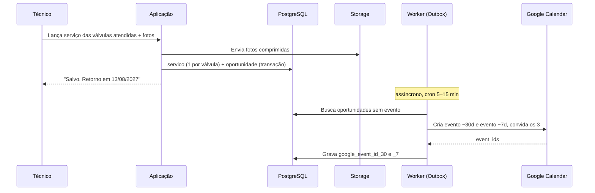

# Arquitetura — Valtis

Fonte de verdade sobre **como** o sistema é construído. Requisitos em [requirements.md](requirements.md), modelo de dados em [database.md](database.md), justificativas em [decisions.md](decisions.md).

---

## 1. Princípio orientador

Um desenvolvedor, três usuários, ~100 registros por ano.

**Microsserviços, filas dedicadas, cache distribuído e orquestração de containers seriam autossabotagem neste projeto.** A escolha é um **monolito modular**: um único projeto, organizado em módulos com fronteiras explícitas, de modo que qualquer parte possa ser extraída no futuro caso isso um dia se justifique.

Corolário para agentes: quando houver duas soluções, **escolha a mais simples que atenda ao requisito**. Complexidade só se paga com um problema real e medido — não com um problema imaginado.

## 2. Camadas

```
┌──────────────────────────────────────────────────────┐
│  Cliente — navegador (celular + PC), PWA instalável  │
│  Lançamento · Painel de status · Fila · Cadastros    │
└───────────────────────┬──────────────────────────────┘
                        │ HTTPS
┌───────────────────────▼──────────────────────────────┐
│  APLICAÇÃO (monolito modular)                        │
│                                                      │
│  ── Apresentação ──────────────────────────────────  │
│     telas, rotas, validação de formulário            │
│                                                      │
│  ── Casos de uso ──────────────────────────────────  │
│     lancarServico · calcularStatusPainel             │
│     gerarOportunidade · assumirOportunidade          │
│     fecharCiclo · emitirRelatorio · importarLegado   │
│     ↑ implementa as regras RN-01..RN-14              │
│                                                      │
│  ── Adaptadores ───────────────────────────────────  │
│     Repositórios · Calendar · Storage · PDF          │
│     · Planilha                                       │
└──────┬─────────────────┬──────────────┬──────────────┘
       │                 │              │
┌──────▼──────┐  ┌───────▼──────┐  ┌────▼─────────────┐
│ PostgreSQL  │  │ Object       │  │ Google Calendar  │
│             │  │ Storage      │  │ (via Outbox)     │
└─────────────┘  └──────────────┘  └──────────────────┘
```

### Regra de ouro

**Os casos de uso não conhecem o Google, nem o Postgres, nem o storage.** Falam com interfaces; os adaptadores implementam.

Consequências práticas, verificáveis em revisão de código:

- Nenhum arquivo da camada de casos de uso importa `googleapis`, `@prisma/client`, SDK de storage ou `fetch`.
- Trocar Supabase por outro Postgres, ou Google Calendar por Outlook, não deve tocar em nenhuma regra de negócio.
- As regras `RN-xx` são testáveis sem banco, sem rede e sem mock de framework.

### O que nunca cruza a fronteira

| Proibido | Onde deveria estar |
|---|---|
| `if` decidindo status, vencimento ou elegibilidade dentro de componente React | Caso de uso |
| Query SQL ou chamada Prisma dentro de caso de uso | Repositório |
| Chamada HTTP externa dentro da transação de escrita | Outbox (§3) |
| Regra de negócio duplicada entre validação de formulário e servidor | Servidor é a autoridade; o formulário só antecipa a mensagem |

## 3. Outbox — a decisão arquitetural mais importante {#outbox}

Atende RNF-14 e RF-31. Justificativa completa em [decisions.md](decisions.md) · D-13.

### O jeito errado

Salvar o serviço e chamar a API do Google na mesma requisição. Se o Google estiver lento, fora do ar, ou o token vencido, o técnico vê um erro e possivelmente perde o registro — o dado mais valioso do sistema.

### O jeito certo

1. Numa **única transação**, grava o `servico` (um por válvula atendida — D-18) e a `oportunidade` correspondente, com `google_event_id_30` e `google_event_id_7` nulos.
2. Responde "salvo" ao usuário imediatamente. A responsabilidade dele termina aqui.
3. Um processo em segundo plano (cron a cada 5–15 min) busca oportunidades sem evento, cria os dois eventos e grava os IDs.
4. Em caso de falha, incrementa `tentativas_sync` e tenta novamente depois. O painel expõe as pendências (RF-33).

### Benefício colateral

**O sistema continua funcionando se o Google Calendar sair do ar ou for descontinuado.** A fonte da verdade é o banco; o Calendar é uma conveniência de notificação, não um componente crítico.

### Fluxo



### Regras do worker

- **Idempotente.** Rodar duas vezes não pode criar evento duplicado. Antes de criar, verifique se o ID já está gravado.
- **Retentativa com espaçamento crescente.** Não martele a API do Google.
- **Limite de tentativas.** Após N falhas, marque para intervenção humana e pare — falha silenciosa infinita é pior que falha visível.
- **Token revogado é alerta, não retentativa.** Se a autenticação falhar, avise; tentar de novo não resolve.

## 4. Autenticação com o Google

Contexto em [decisions.md](decisions.md) · D-01.

A Manutec usa **Gmail comum**, não Google Workspace. Isso elimina a conta de serviço: ela não consegue enviar convites para contas Gmail externas.

**Arranjo adotado:**

1. Uma conta Gmail **institucional** (não pessoal de funcionário) é dona da agenda "Manutenções VRP".
2. A agenda é compartilhada com os 3 usuários, com permissão de alteração.
3. O sistema autentica **como essa conta** via OAuth, guardando um refresh token.

**Armadilhas conhecidas — tratar como requisito, não como detalhe:**

- Refresh token de app OAuth em modo *Testing* **expira em poucos dias**. É obrigatório publicar o app como "Em produção" no Google Cloud Console.
- O app não será verificado pelo Google; quem autorizar verá uma tela de aviso. É esperado e contornável, uma vez só.
- Escopo mínimo: apenas eventos da agenda de manutenções. Nada de Gmail, Drive ou contatos.
- Essa conta é um **ponto único de falha**. Recuperação configurada e credenciais em cofre acessível a mais de uma pessoa.

## 5. Painel: calculado, não materializado

`dias_restantes` e `status` mudam sozinhos com a passagem do tempo. Materializá-los cria uma classe inteira de bug: painel desatualizado.

**Decisão (D-15):** calcular na consulta, em tempo real. Com ~1.200 válvulas o custo é irrelevante. Só materialize se houver problema de desempenho **medido** — e não haverá.

## 6. Módulos

| # | Módulo | Responsabilidade | Fase |
|---|---|---|---|
| M1 | **Acesso** | Login, sessão, perfis | 1 |
| M2 | **Cadastros** | Cliente, Especificação, Estação, Válvula. Busca e criação inline | 1 |
| M3 | **Lançamento** | Formulário de serviço **por válvula** (D-18), com replicação para as demais válvulas da estação (RF-15b). Otimizado para celular. O módulo mais sensível do sistema | 1 |
| M4 | **Painel** | Status calculado, filtros, resumo, SEM REGISTRO | 1 |
| M5 | **Recorrência** | Cálculo de vencimento e geração de oportunidade (RN-01 a RN-07) | 1 |
| M6 | **Calendar** | Adaptador Google + worker de outbox + reprocessamento | 1 |
| M7 | **Importador** | Carga dos 296 clientes, deduplicação assistida, data aproximada | 1 |
| M8 | **Anexos** | Câmera, galeria, compressão, upload | 2 |
| M9 | **Relatórios** | PDF e compartilhamento | 2 |
| M10 | **Pipeline** | Fila, assumir, desfecho, recusa com pergunta, fechamento de ciclo | 3 |
| M11 | **Indicadores** | Conversão e clientes recuperados | 3 |
| M12 | **Administração** | Configurações, auditoria | 3 |

**Dependências:** M1 e M2 sustentam todos os demais. M5 depende de M3. M4 e M6 dependem de M5. M7 depende de M2. M10 depende de M5.

## 7. Stack

Definida em [decisions.md](decisions.md) · **D-20**. O backend é uma **API REST**; o frontend é uma aplicação separada que a consome.

### Backend

| Camada | Escolha | Por quê |
|---|---|---|
| Linguagem | **Java 21 (LTS)** | Objetivo de carreira além do produto (D-20). LTS garante suporte longo |
| Framework | **Spring Boot 3** | Padrão de mercado em Java corporativo. Traz injeção de dependência, transações e agendador prontos |
| Build | **Maven** | Mais comum em vagas e em código legado do que Gradle |
| Persistência | **Spring Data JPA / Hibernate** | Mapeamento objeto-relacional idiomático do ecossistema |
| Migrações | **Flyway** | Versionadas e revisáveis — casa com a exigência de aprovação do AGENTS.md §10 |
| Banco | **PostgreSQL** | Relacional é o ajuste natural para Cliente→Estação→Válvula→Serviço |
| Segurança | **Spring Security** | Autenticação e autorização (RF-01, RNF-23) |
| Worker do Outbox | **`@Scheduled`** do Spring | Nativo. Fila dedicada é overkill para 100 registros/ano |
| Calendar | **google-api-client** (SDK Java) + OAuth refresh token | D-01. Isolado atrás do Outbox |
| PDF | **JasperReports** | Padrão em Java corporativo e habilidade valorizada em vaga. ⚠️ Cuidado com alternativas: **iText 7 é AGPL**, restritivo para uso comercial |
| Planilha | **Apache POI** | Importação da base legada e exportação para Excel |
| Testes | **JUnit 5 + Mockito + Testcontainers** | Testcontainers roda Postgres real no teste — mais fiel que banco em memória |

### Frontend

| Camada | Escolha | Por quê |
|---|---|---|
| Framework | **React + Vite + TypeScript** | Mais vagas no agregado e curva mais suave que Angular. Next.js seria redundante com um backend Spring |
| Estilo | **Tailwind + shadcn/ui** | Rápido, responsivo por padrão, componentes prontos |
| Fotos | Compressão **no navegador** antes do upload | Economiza storage e dados móveis do técnico |

### Infraestrutura

| Item | Escolha | Por quê |
|---|---|---|
| Deploy backend | **Railway ou Render** (container) | ⚠️ **Vercel não hospeda Java** |
| Deploy frontend | **Vercel ou Netlify** (estático) | Build do Vite publicado direto do Git |
| Storage de fotos | Supabase Storage ou compatível com S3 | Acessado pelo backend, nunca direto pelo navegador |
| Segredos | Variáveis de ambiente + cofre de senhas da empresa | O refresh token do Google é o segredo mais crítico |
| Erros | **Sentry** (gratuito) | Sem isso, bug só aparece quando alguém reclama |

### Alternativas descartadas

| Alternativa | Por que não |
|---|---|
| **Manter na planilha** | É o concorrente mais sério e merece resposta honesta: a planilha já faz painel, status e regras. O que ela **não** faz: agendar no Calendar, guardar foto, gerar PDF, ser preenchida com conforto no celular, impedir duas pessoas de sobrescreverem a mesma célula, e manter auditoria |
| Google Forms + Sheets + Apps Script | Sai em dias e é barato, mas não sustenta o relacionamento entre estação, válvula e histórico |
| App nativo (React Native/Flutter) | Duas bases de código, lojas, atualização lenta. Não se justifica para 3 usuários |
| Airtable / Notion | Custo por usuário, integração limitada com Calendar, lock-in de dados |
| Laravel / Django | Ótimos frameworks, mas fora do objetivo de carreira definido em D-20 |
| **TypeScript / Next.js** | Era a escolha original (D-12). Menos superfície para manter, mas exigiria um projeto paralelo em Java para o portfólio — ver D-20 |
| **Angular** no lugar de React | Dupla clássica do Java corporativo brasileiro, mas curva mais íngreme. Com 10h semanais divididas entre aprender e construir, o custo pesou |
| **Thymeleaf** (telas no próprio Spring) | Entregaria bem mais rápido, mas não sustenta a alegação de full stack — que é parte do objetivo do projeto |
| MongoDB | O domínio é fortemente relacional |

## 8. Anti-padrões neste projeto

Coisas que parecem boas práticas e aqui são erro. Um agente que introduzir qualquer uma delas deve justificar no PR:

- **Otimizar por desempenho sem medição.** O volume é de ~100 registros/ano. Cache, desnormalização e índice especulativo são complexidade sem contrapartida.
- **Abstrair antes da terceira repetição.** Abstração prematura custa mais que duplicação.
- **Separar em serviços.** Ver §1.
- **Materializar o painel.** Ver §5.
- **Chamar API externa na transação.** Ver §3.
- **Traduzir termos de domínio.** Ver AGENTS.md §4.
- **Exclusão física.** Tudo é `ativo = false` (RN-11).
- **Regra de negócio no componente.** Ver §2.
- **Agrupar serviços numa entidade "visita".** O registro é por válvula (D-18). Três válvulas atendidas juntas são três linhas — isso é intencional, não duplicação a ser normalizada.
- **Assumir no máximo duas válvulas por estação.** São N (D-19).
