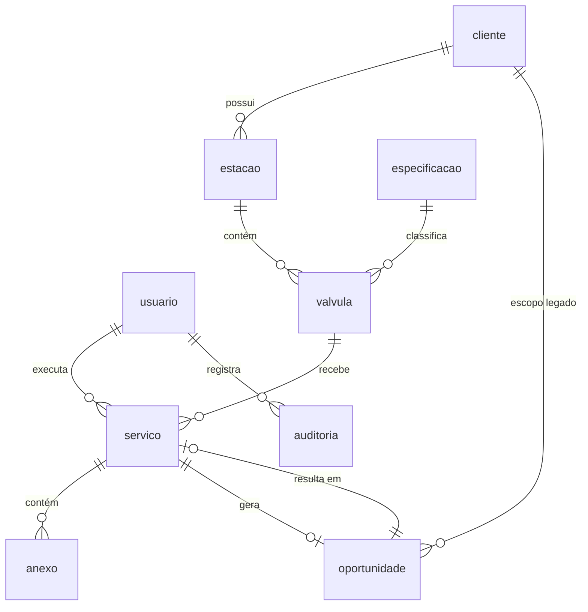

# Modelo de dados — Valtis

Fonte de verdade sobre entidades, campos e relacionamentos. Requisitos em [requirements.md](requirements.md), arquitetura em [architecture.md](architecture.md), justificativas em [decisions.md](decisions.md).

> ⚠️ **Qualquer alteração de schema exige aprovação humana explícita.** Ver AGENTS.md §10. Isso inclui criar, renomear ou remover tabela ou coluna, alterar enum ou constraint, e gerar ou executar migração.

---

## 1. Convenções

| Item | Convenção | Exemplo |
|---|---|---|
| Nome de tabela | Português, **singular**, snake_case | `valvula`, `especificacao`, `oportunidade` |
| Nome de coluna | Português, snake_case | `numero_valvula`, `requer_fechamento_geral` |
| Chave primária | Sempre `id` | `id` |
| Chave estrangeira | `<tabela>_id` | `estacao_id`, `cliente_id` |
| Booleano | Prefixo verbal, sem negação | `ativo`, `requer_fechamento_geral` — **nunca** `nao_ativo` |
| Data/hora | `timestamptz`, armazenada em **UTC** | `criado_em` |
| Data pura | `date` quando não há hora relevante | `data_realizada` |
| Auditoria | `criado_em`, `atualizado_em` em toda tabela de negócio | |
| Exclusão | **Sempre lógica** via `ativo = false` (RN-11) | |

**Por que português nas tabelas:** os termos do domínio não sobrevivem à tradução. `sindico` não é *manager*; `barrilete` e `shaft` não têm equivalente útil. Ver [decisions.md](decisions.md) · D-14.

**Atenção:** o vocabulário é o da planilha, mas os identificadores seguem convenção de banco. A planilha usa `id_equipamento` como chave da aba `equipamentos`; aqui a tabela é `valvula` com PK `id`. O mapeamento está na §6.

## 2. Diagrama



### Hierarquia central

```
cliente (condomínio)
  └── estacao (ponto de instalação: barrilete, shaft…)
        └── valvula (equipamento físico, numerada 01, 02, 03…)
              └── servico (uma intervenção por válvula)
```

> **O serviço pertence à válvula, não à estação** (D-18). Mesmo quando a equipe atende a estação inteira numa única visita, cada válvula gera seu próprio registro — o histórico técnico pertence ao equipamento. A interface pode preencher uma vez e replicar para as demais válvulas da estação, mas isso é conveniência de tela: os registros permanecem independentes.

## 3. Entidades

### usuario
As 3 pessoas com acesso.

| Coluna | Tipo | Notas |
|---|---|---|
| `id` | uuid PK | |
| `nome` | text | |
| `email` | text | único |
| `senha_hash` | text | |
| `perfil` | enum `perfil_usuario` | `tecnico` \| `admin` |
| `ativo` | boolean | padrão `true` |
| `criado_em` | timestamptz | |

### cliente
O condomínio. Uma linha por prédio — **cliente e prédio são a mesma coisa** neste domínio (ver D-17).

| Coluna | Tipo | Notas |
|---|---|---|
| `id` | uuid PK | |
| `codigo_referencia` | text | único. Padrão `COND-001` |
| `nome_condominio` | text | |
| `endereco` | text | |
| `bairro` | text | |
| `cidade` | text | |
| `sindico_responsavel` | text | **dado pessoal — LGPD** (RNF-22) |
| `telefone_contato` | text | **dado pessoal** |
| `email_contato` | text | **dado pessoal** |
| `tipo_atendimento` | enum | `Contrato` \| `Avulso`. Informação comercial; **não** afeta prazo (RN-03) |
| `status_contrato` | enum | `Ativo` \| `Suspenso` \| `Inativo` |
| `ativo` | boolean | |
| `origem` | enum `origem_registro` | `sistema` \| `importacao` |
| `ultima_manutencao_legado` | date, nulo | Só para importados (RF-51) |
| `data_legado_aproximada` | boolean | `true` quando a data veio de metadado de arquivo (RF-58) |
| `cadastro_incompleto` | boolean | `true` para importados sem estação/válvula (RF-53) |
| `criado_em` / `atualizado_em` | timestamptz | |

### especificacao
Catálogo técnico reutilizável. Cadastra-se a combinação uma vez; várias válvulas apontam para ela.

| Coluna | Tipo | Notas |
|---|---|---|
| `id` | uuid PK | |
| `marca` | text | ex.: Bermad, Cla-Val, Dorot |
| `modelo` | text | ex.: 720, 90-01, 300 Series |
| `diametro_polegadas` | text | ex.: `2`, `3`, `1.1/2`. **Texto**, não numérico — polegadas fracionárias |
| `tipo_registro` | enum | `Esfera` \| `Gaveta` |
| `descricao_completa` | text, calculado | `Bermad 720 - 2" Esfera` |
| `ativo` | boolean | |

Único: (`marca`, `modelo`, `diametro_polegadas`, `tipo_registro`).

### estacao
Ponto de instalação que agrupa uma ou mais válvulas. Entidade central do modelo — é o que a empresa fatura (D-07).

| Coluna | Tipo | Notas |
|---|---|---|
| `id` | uuid PK | |
| `cliente_id` | uuid FK → cliente | |
| `localizacao_instalacao` | text | ex.: "Barrilete - Casa de bombas", "Shaft hidráulico - 5º pavimento" |
| `andar_inicial` | integer | **Térreo = 0. Subsolo = negativo** (-1, -2) |
| `andar_final` | integer | |
| `requer_fechamento_geral` | boolean | Se o serviço exige interromper o abastecimento do prédio. Informação operacional crítica — vai no evento do Calendar (RF-29) |
| `ativo` | boolean | |
| `criado_em` / `atualizado_em` | timestamptz | |

> Uma estação comporta **N válvulas** — tipicamente 2, mas pode ter mais (D-19). Nenhuma tela deve assumir limite de duas.
>
> **Pendência P-01 (parcial):** falta definir se a estação contém outros componentes relevantes (filtro Y, manômetros, registros de bloqueio) e se a periodicidade é da válvula ou da estação.

### valvula
O equipamento físico.

| Coluna | Tipo | Notas |
|---|---|---|
| `id` | uuid PK | |
| `estacao_id` | uuid FK → estacao | |
| `especificacao_id` | uuid FK → especificacao | |
| `codigo_referencia` | text | único. `COND-001-VRP-01` (RN-14) |
| `numero_valvula` | text | Sequencial dentro da estação, com zero à esquerda: `01`, `02`, `03`… **Sem limite fixo** (D-19) |
| `numero_serie` | text, nulo | |
| `data_instalacao` | date, nulo | |
| `periodicidade_meses` | integer | **padrão 12**. Editável só em exceções (RN-02) |
| `ativo` | boolean | |
| `criado_em` / `atualizado_em` | timestamptz | |

> **Regra de numeração (`numero_valvula`):**
> **01** = a da **esquerda** quando as válvulas estão em **paralelo** (lado a lado), ou a de **cima** quando estão **uma sobre a outra**.
> As demais seguem na mesma direção de leitura: `02`, `03`, e assim por diante. Válvula única no ponto = **01**.

Único: (`estacao_id`, `numero_valvula`) — base do alerta de duplicidade (RF-13).

### servico
A intervenção realizada. **Uma linha por válvula atendida** (D-18), mesmo quando a visita cobre a estação inteira.

| Coluna | Tipo | Notas |
|---|---|---|
| `id` | uuid PK | |
| `valvula_id` | uuid FK → valvula | A estação é alcançada por `valvula → estacao` |
| `data_realizada` | date | **Informada pelo técnico**, nunca assumida como a data de preenchimento (RF-17) |
| `tipo_manutencao` | enum | `Preventiva` \| `Corretiva` |
| `tecnico_responsavel_id` | uuid FK → usuario | |
| `pecas_substituidas` | text, nulo | |
| `pressao_entrada` | numeric, nulo | **Opcional** (D-10) |
| `pressao_saida` | numeric, nulo | **Opcional** (D-10) |
| `observacoes` | text, nulo | |
| `status` | enum `status_servico` | `rascunho` \| `concluido` |
| `criado_por_id` | uuid FK → usuario | Pode diferir do técnico responsável |
| `criado_em` / `atualizado_em` | timestamptz | `criado_em` ≠ `data_realizada` — ver D-02 |

**Nunca sobrescrever** um serviço anterior. Toda intervenção é uma linha nova (RF-18).

> **Sobre atendimentos simultâneos:** quando três válvulas da mesma estação são atendidas na mesma visita, o resultado são **três linhas** de `servico` com a mesma `data_realizada` e o mesmo técnico. Isso é intencional — o histórico técnico pertence ao equipamento, e válvulas do mesmo barrilete podem ter idades, marcas e desgastes diferentes. Não introduza uma entidade "visita" para agrupá-las sem aprovação (AGENTS.md §10).

### anexo
Fotos do atendimento.

| Coluna | Tipo | Notas |
|---|---|---|
| `id` | uuid PK | |
| `servico_id` | uuid FK → servico | |
| `valvula_id` | uuid FK → valvula, nulo | Quando a foto é de uma válvula específica |
| `caminho_arquivo` | text | Referência no object storage, não o binário |
| `tipo_mime` | text | |
| `tamanho_bytes` | bigint | |
| `legenda` | text, nulo | |
| `criado_em` | timestamptz | |

### oportunidade
O retorno previsto e seu desfecho comercial. É a entidade que transforma "dinheiro na mesa" em número mensurável.

| Coluna | Tipo | Notas |
|---|---|---|
| `id` | uuid PK | |
| `escopo` | enum `escopo_oportunidade` | `valvula` \| `cliente` — ver nota abaixo |
| `cliente_id` | uuid FK → cliente | sempre preenchido |
| `valvula_id` | uuid FK → valvula, nulo | **nulo quando `escopo = cliente`** |
| `servico_origem_id` | uuid FK → servico, nulo | nulo quando importada |
| `data_prevista` | date | `data_realizada + periodicidade_meses` (RN-01) |
| `data_alerta_30` | date | `data_prevista − 30 dias` (RN-06) |
| `data_alerta_7` | date | `data_prevista − 7 dias` (RN-06) |
| `status` | enum `status_oportunidade` | `agendado` \| `contatado` \| `aceito` \| `recusado` \| `executado` \| `perdido` |
| `responsavel_id` | uuid FK → usuario, nulo | **nulo até alguém assumir** (RN-07, D-04) |
| `assumida_em` | timestamptz, nulo | |
| `motivo_recusa` | text, nulo | RF-45 |
| `origem` | enum `origem_registro` | `sistema` \| `importacao` |
| `google_event_id_30` | text, nulo | preenchido pelo worker do Outbox |
| `google_event_id_7` | text, nulo | idem |
| `sincronizado_em` | timestamptz, nulo | |
| `tentativas_sync` | integer | padrão 0 |
| `notas` | text, nulo | |
| `servico_resultante_id` | uuid FK → servico, nulo | fecha o ciclo (RN-10) |

> **O campo `escopo` é o que viabiliza a importação (D-09).** A base real não tem informação de qual válvula foi atendida — só cliente e data. Esses 296 clientes geram oportunidades de **escopo cliente**, sem válvula vinculada. Quando o técnico visitar e cadastrar as válvulas, os ciclos seguintes passam a ser de escopo válvula.

### auditoria

| Coluna | Tipo |
|---|---|
| `id` | uuid PK |
| `usuario_id` | uuid FK → usuario |
| `entidade` | text |
| `entidade_id` | uuid |
| `acao` | enum: `criou` \| `alterou` \| `inativou` |
| `dados_antes` | jsonb, nulo |
| `dados_depois` | jsonb, nulo |
| `criado_em` | timestamptz |

## 4. Enums {#enums}

Valores fixos vindos da planilha da Manutec. **A interface usa lista suspensa; nunca texto livre** (RNF-06).

| Enum | Valores |
|---|---|
| `perfil_usuario` | `tecnico` · `admin` |
| `tipo_atendimento` | `Contrato` · `Avulso` |
| `status_contrato` | `Ativo` · `Suspenso` · `Inativo` |
| `tipo_registro` | `Esfera` · `Gaveta` |
| `tipo_manutencao` | `Preventiva` · `Corretiva` |
| `status_servico` | `rascunho` · `concluido` |
| `status_oportunidade` | `agendado` · `contatado` · `aceito` · `recusado` · `executado` · `perdido` |
| `escopo_oportunidade` | `valvula` · `cliente` |
| `origem_registro` | `sistema` · `importacao` |
| `status_painel` | **calculado, não persistido** — ver §5 |

## 5. Status do painel — calculado, nunca armazenado

`status_painel` e `dias_restantes` **não são colunas**. São derivados na consulta (D-15), porque mudam sozinhos com a passagem do tempo — armazená-los criaria painel desatualizado.

| Status | Condição |
|---|---|
| `SEM REGISTRO` | Válvula sem nenhum serviço lançado. **Não gera oportunidade** (RN-05) |
| `VENCIDO` | `dias_restantes < 0` |
| `PRÓXIMO DO VENCIMENTO` | `0 ≤ dias_restantes ≤ 30` |
| `EM DIA` | `dias_restantes > 30` |

Onde `dias_restantes = data_proxima_manutencao − hoje`, e `data_proxima_manutencao = último data_realizada + periodicidade_meses`.

## 6. Importação da base legada {#importação-da-base-legada}

Origem: `RELATORIO NF MANUTENCAO VALVULAS - CONSOLIDADO.xlsx`, abas `Alertas` e `Matriz Cliente x Ano`. Escopo definido em D-09.

### O que entra

| Campo de destino | Origem | Observação |
|---|---|---|
| `cliente.nome_condominio` | `Cliente / Edifício` | Requer limpeza — ver riscos |
| `cliente.ultima_manutencao_legado` | `Última manutenção` | **Data aproximada** |
| `cliente.data_legado_aproximada` | — | Sempre `true` |
| `cliente.origem` | — | Sempre `importacao` |
| `cliente.cadastro_incompleto` | — | Sempre `true` |
| `oportunidade` | derivada | `escopo = cliente`, sem válvula |

### O que **não** entra

- As 595 intervenções individuais (RF-52). Só o cliente e a data do último atendimento.
- Estações e válvulas — a base real não tem essa informação. Serão cadastradas na próxima visita, com o técnico na frente do equipamento.
- **Eventos retroativos no Calendar** (RN-13). Criar 205 eventos no passado inutilizaria a agenda. Esses clientes aparecem no painel como lista de ação imediata.

### Riscos conhecidos da base legada

**As datas são aproximadas.** A planilha avisa: *"Data = data de modificação do arquivo; pode diferir da data de emissão impressa na NF."* Para os 153 clientes com 24+ meses sem manutenção isso é irrelevante — a ação é a mesma. Importa para quem está perto da janela. Daí o `data_legado_aproximada`.

**Nomes inconsistentes.** Amostras reais: `02 OPERA CLASSIC`, `02 TSAR`, `1976ED CAIS DA AURORA`. Prefixos numéricos são resíduo de nome de pasta. O mesmo condomínio provavelmente aparece com grafias diferentes entre as bases `RECIBOS` (409 NFs) e `MANUTEC VRP` (186 NFs).

**A deduplicação é assistida, nunca automática** (RF-57). O sistema agrupa candidatos por similaridade e **o humano decide** o que é o mesmo cliente. Deduplicar sozinho pode fundir dois condomínios distintos — erro silencioso e difícil de desfazer.

### Mapeamento planilha de controle → banco

Referência de vocabulário: `Controle_Manutencao_VRP_Final.xlsx`.

| Aba / coluna da planilha | Tabela / coluna |
|---|---|
| `clientes.id_cliente` | `cliente.id` |
| `clientes.*` | `cliente.*` (mesmos nomes) |
| `catalogo_especificacoes.id_especificacao` | `especificacao.id` |
| `equipamentos.id_equipamento` | `valvula.id` |
| `equipamentos.codigo_referencia_equipamento` | `valvula.codigo_referencia` |
| `equipamentos.localizacao_instalacao` | `estacao.localizacao_instalacao` |
| `equipamentos.andar_inicial` / `andar_final` | `estacao.andar_inicial` / `andar_final` |
| `equipamentos.requer_fechamento_geral` | `estacao.requer_fechamento_geral` |
| `historico_manutencoes.id_manutencao` | `servico.id` |
| `historico_manutencoes.data_realizada` | `servico.data_realizada` |
| `historico_manutencoes.id_equipamento` | `servico.valvula_id` |
| `historico_manutencoes.pecas_substituidas` | `servico.pecas_substituidas` |
| `painel_status.*` | **não persistido** — calculado (§5) |
| `legenda_regras` (dias de alerta) | configuração da aplicação |

> As colunas `localizacao_instalacao`, `andar_inicial`, `andar_final` e `requer_fechamento_geral` são repetidas por válvula na planilha. Ao migrar, elas **sobem** para `estacao` — foi essa repetição que revelou a existência da estação como entidade (D-17).

## 7. Índices sugeridos

Poucos, e só onde há consulta real. O volume não justifica mais (RNF-12).

- `valvula (estacao_id)`
- `estacao (cliente_id)`
- `servico (valvula_id, data_realizada DESC)` — histórico e cálculo do último serviço de cada válvula
- `oportunidade (status, data_prevista)` — consulta principal do painel e da fila
- `oportunidade (google_event_id_30) WHERE google_event_id_30 IS NULL` — varredura do worker do Outbox
- `cliente (nome_condominio)` — busca

## 8. Glossário do domínio {#glossário-do-domínio}

| Termo | Significado |
|---|---|
| **VRP** | Válvula Redutora de Pressão. Reduz a pressão da rede para faixas seguras de uso predial |
| **Estação redutora** | Conjunto que contém várias VRPs, geralmente em paralelo, atendendo uma faixa de andares. É a unidade faturada |
| **Barrilete** | Tubulação de distribuição, normalmente na casa de bombas |
| **Shaft** | Prumada vertical de tubulação, por onde passam as instalações entre pavimentos |
| **Fechamento geral** | Necessidade de interromper o abastecimento do prédio inteiro para executar o serviço |
| **Filtro Y** | Filtro instalado a montante da válvula para reter sujeira |
| **Piloto** | Componente que comanda a regulagem da VRP |
| **Síndico** | Representante legal do condomínio. Papel jurídico brasileiro, sem equivalente direto em inglês |
| **Administradora** | Empresa que gere o condomínio; muitas vezes é quem aprova o serviço |
| **Avulso × Contrato** | Modalidade comercial do atendimento. Não altera a periodicidade técnica (RN-03) |
| **Soft delete** | Inativação lógica; o registro permanece no banco (RN-11) |
| **Outbox** | Padrão em que a integração externa é gravada no banco e executada depois, em segundo plano |
